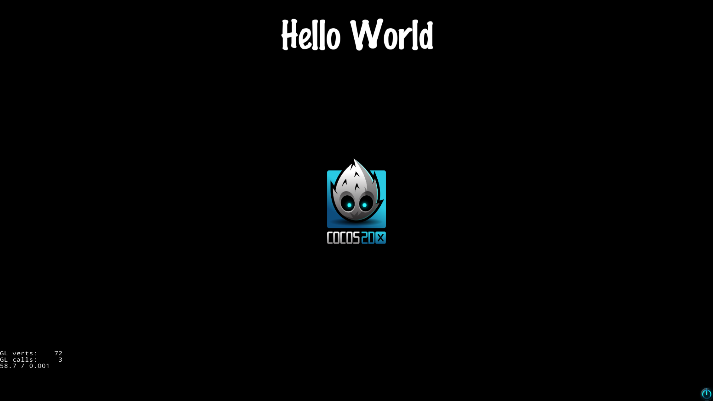
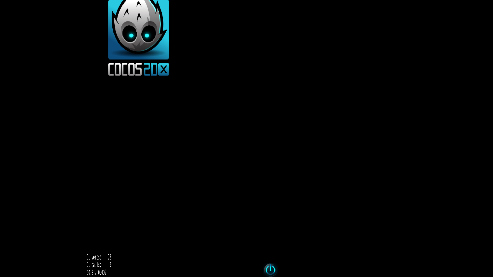

# Creating the project

*Platform*: Windows 10, DOS prompt
*Version of Cocos2d-x used: cocos2d-x-3.13.1*

```sh
C:\Users\droid>cocos new --help
usage: cocos new [-h] [-p PACKAGE_NAME] [-d DIRECTORY] [-t TEMPLATE_NAME]
                 [--ios-bundleid IOS_BUNDLEID] [--mac-bundleid MAC_BUNDLEID]
                 [-e ENGINE_PATH] [--portrait] [--no-native] -l {cpp,lua,js}
                 [PROJECT_NAME]

Creates a new project.

positional arguments:
  PROJECT_NAME          Set the project name.

optional arguments:
  -h, --help            show this help message and exit
  -p PACKAGE_NAME, --package PACKAGE_NAME
                        Set a package name for project.
  -d DIRECTORY, --directory DIRECTORY
                        Set the path where to place the new project.
  -t TEMPLATE_NAME, --template TEMPLATE_NAME
                        Set the template name you want create from.
  --ios-bundleid IOS_BUNDLEID
                        Set a bundle id for iOS project.
  --mac-bundleid MAC_BUNDLEID
                        Set a bundle id for Mac project.
  -e ENGINE_PATH, --engine-path ENGINE_PATH
                        Set the path of engine.
  --portrait            Set the project be portrait.
  -l {cpp,lua,js}, --language {cpp,lua,js}
                        Major programming language you want to use, should be
                        [cpp | lua | js]

lua/js project arguments:
  --no-native           Create the project without native support.
```

Create a new project with the *cocos new* command.

```sh
C:\Users\droid>cocos new CocosBasic -p com.trdroid.basicgame -l cpp -d C:\Users\droid\onGit\cocos2d-x-templates
> Copy template into C:\Users\droid\onGit\cocos2d-x-templates
> Copying Cocos2d-x files...
> Rename project name from 'HelloCpp' to 'CocosBasic'
> Replace the project name from 'HelloCpp' to 'CocosBasic'
> Replace the project package name from 'org.cocos2dx.hellocpp' to 'com.trdroid.basicgame'
> Replace the Mac bundle id from 'org.cocos2dx.hellocpp' to 'com.trdroid.basicgame'
> Replace the iOS bundle id from 'org.cocos2dx.hellocpp' to 'com.trdroid.basicgame'
```

The parameters to the *cocos new* command are:

* **Project Name**: The name of the project is "CocosBasic"
* **Android Package Name**: The *-p* switch followed by the name of the package for the Android app which acts as the application ID in the Google Play Store
* **Programming Language**: The *-l* switch followed by the language to be used for the project
* **Project Location**: The *-d* switch followed by location where the project has to be generated. 

### Project Structure


### Building and Running from the console

```sh
c:\Users\droid>cocos run --help
usage: cocos run [-h] [-s SRC_DIR] [-q] [-p PLATFORM] [--list-platforms]
                 [--proj-dir PROJ_DIR] [-m MODE] [-b BROWSER] [--param PARAM]
                 [--port [SERVER_PORT]] [--host [SERVER_HOST]] [--no-console]
                 [--working-dir WORKING_DIR]

Compiles, deploy and run project on the target.

optional arguments:
  -h, --help            show this help message and exit
  -s SRC_DIR, --src SRC_DIR
                        Specify the path of the project.
  -q, --quiet           Less output
  -p PLATFORM, --platform PLATFORM
                        Specify the target platform.
  --list-platforms      List available platforms
  --proj-dir PROJ_DIR   Specify the directory for target platform.
  -m MODE, --mode MODE  Set the run mode, should be debug|release, default is
                        debug.

web project arguments:
  -b BROWSER, --browser BROWSER
                        Specify the browser to open the url. Use the system
                        default browser if not specified.
  --param PARAM         after Specify the browser to open the url, add the
                        browser param.
  --port [SERVER_PORT]  Set the port of the local web server, defualt is 8000
  --host [SERVER_HOST]  Set the host of the local web server, defualt is
                        127.0.0.1
  --no-console          Disable simulator console window (by passing command
                        line arguments '-console no' to simulator) for
                        Windows, Mac and Linux.
  --working-dir WORKING_DIR
                        Specify simulator working directory for Windows, Mac
                        and Linux (by passing command line arguments '-workdir
                        "<path>"' to simulator).
```

```sh
C:\Users\droid>cocos run -s c:\Users\droid\onGit\cocos2d-x-templates\CocosBasic -p android
Building mode: debug
Using Eclipse project : c:\Users\droid\onGit\cocos2d-x-templates\CocosBasic\proj.android
The directory 'android-13' can't be found in ANDROID_SDK_ROOT/platforms, please use --ap to set needed API level
```

The error indicates that "android-13" is not found in ANDROID_SDK_ROOT/platforms. Note that ANDROID_SDK_ROOT was set when the *cocos* command was first run, the information for which is in the Cocos2d-x-Examples repository. The ANDROID_SDK_ROOT was set to "C:\Software\Android\platforms" which contains "android-14 .. android-24" directories but not "android-13".

Explicitly specifying the Android API level to be "16"

```sh
C:\Users\droid>cocos run -s c:\Users\droid\onGit\cocos2d-x-templates\CocosBasic -p android --ap 16
Building mode: debug
Using Eclipse project : c:\Users\droid\onGit\cocos2d-x-templates\CocosBasic\proj.android
The directory '16' can't be found in ANDROID_SDK_ROOT/platforms, please use --ap to set needed API level
```

Do not specify just the number of the API level but the directory name itself.

Explicitly specifying the Android API level directory "android-16"

```sh
C:\Users\droid>cocos run -s c:\Users\droid\onGit\cocos2d-x-templates\CocosBasic -p android --ap android-16
Building mode: debug
Using Eclipse project : c:\Users\droid\onGit\cocos2d-x-templates\CocosBasic\proj.android
running: '"C:\Software\Android\tools\android" update project -t android-16 -p c:\Users\droid\onGit\cocos2d-x-templates\CocosBasic\proj.android'

Updated project.properties
Updated local.properties
Updated file c:\Users\droid\onGit\cocos2d-x-templates\CocosBasic\proj.android\proguard-project.txt
running: '"C:\Software\Android\tools\android" update lib-project -p c:\Users\droid\onGit\cocos2d-x-templates\CocosBasic\cocos2d\cocos\platform\android\java -t android-16'

Updated project.properties
Updated local.properties
Updated file c:\Users\droid\onGit\cocos2d-x-templates\CocosBasic\cocos2d\cocos\platform\android\java\proguard-project.txt
Building native...
NDK build mode: debug
running: '"C:\Software\Android NDK\android-ndk-r12b\ndk-build" -C c:\Users\droid\onGit\cocos2d-x-templates\CocosBasic\proj.android -j4 NDK_MODULE_PATH=c:\Users\droid\onGit\cocos2d-x-templates\CocosBasic\proj.android\../cocos2d;c:\Users\droid\onGit\cocos2d-x-templates\CocosBasic\proj.android\../cocos2d/cocos;c:\Users\droid\onGit\cocos2d-x-templates\CocosBasic\proj.android\../cocos2d/external NDK_TOOLCHAIN_VERSION=4.9 NDK_DEBUG=1'

'C:\Software\Android' is not recognized as an internal or external command,
operable program or batch file.
Error running command, return code: 1.
```

The problem occurred because of setting the "NDK_ROOT" to point to "C:\Software\Android NDK\android-ndk-r12b" which contains a space in its path, so change the name of the directory "Android NDK" to "Android-NDK" and update the modified path in the "environment variables" against the "NDK_ROOT" environment variable. 

NOTE: The environment variables ANDROID_SDK_ROOT, NDK_ROOT & ANT_ROOT were set when the *cocos* command was first run, the information about which can be found in Cocos2d-x-Examples repository.

```sh
C:\Users\droid>cocos run -s c:\Users\droid\onGit\cocos2d-x-templates\CocosBasic -p android --ap android-16
Building mode: debug
Using Eclipse project : c:\Users\droid\onGit\cocos2d-x-templates\CocosBasic\proj.android
running: '"C:\Software\Android\tools\android" update project -t android-16 -p c:\Users\droid\onGit\cocos2d-x-templates\CocosBasic\proj.android'

Updated project.properties
Updated local.properties
Updated file c:\Users\droid\onGit\cocos2d-x-templates\CocosBasic\proj.android\proguard-project.txt
running: '"C:\Software\Android\tools\android" update lib-project -p c:\Users\droid\onGit\cocos2d-x-templates\CocosBasic\cocos2d\cocos\platform\android\java -t android-16'

Updated project.properties
Updated local.properties
Updated file c:\Users\droid\onGit\cocos2d-x-templates\CocosBasic\cocos2d\cocos\platform\android\java\proguard-project.txt
Building native...
NDK build mode: debug
running: '"C:\Software\Android-NDK\android-ndk-r12b\ndk-build" -C c:\Users\droid\onGit\cocos2d-x-templates\CocosBasic\proj.android -j4 NDK_MODULE_PATH=c:\Users\droid\onGit\cocos2d-x-templates\CocosBasic\proj.android\../cocos2d;c:\Users\droid\onGit\cocos2d-x-templates\CocosBasic\proj.android\../cocos2d/cocos;c:\Users\droid\onGit\cocos2d-x-templates\CocosBasic\proj.android\../cocos2d/external NDK_TOOLCHAIN_VERSION=4.9 NDK_DEBUG=1'

Android NDK: WARNING: APP_PLATFORM android-16 is larger than android:minSdkVersion 9 in ./AndroidManifest.xml
make: Entering directory `c:/Users/droid/onGit/cocos2d-x-templates/CocosBasic/proj.android'
[armeabi] Compile++ arm  : cocostudio_static <= WidgetReader.cpp
[armeabi] Compile++ arm  : cocostudio_static <= FlatBuffersSerialize.cpp
[armeabi] Compile++ arm  : cocostudio_static <= WidgetCallBackHandlerProtocol.cpp
[armeabi] Compile++ arm  : cocostudio_static <= CCComExtensionData.cpp
[armeabi] Compile++ arm  : cocostudio_static <= CocoStudio.cpp
[armeabi] Compile++ arm  : cocos_ui_static <= UILayoutComponent.cpp
[armeabi] Compile++ arm  : cocos_ui_static <= UITabControl.cpp
[armeabi] Gdbserver      : [arm-linux-androideabi-4.9] libs/armeabi/gdbserver
[armeabi] Gdbsetup       : libs/armeabi/gdb.setup
[armeabi] Compile++ thumb: MyGame_shared <= main.cpp
[armeabi] Compile++ thumb: MyGame_shared <= AppDelegate.cpp
[armeabi] Compile++ thumb: MyGame_shared <= HelloWorldScene.cpp
[armeabi] StaticLibrary  : libcocos2d.a
[armeabi] Compile++ arm  : cocostudio_static <= CCActionFrame.cpp
[armeabi] Compile++ arm  : cocostudio_static <= CCActionFrameEasing.cpp
[armeabi] Compile++ arm  : cocostudio_static <= CCActionManagerEx.cpp
[armeabi] Compile++ arm  : cocostudio_static <= CCActionNode.cpp
[armeabi] Compile++ arm  : cocostudio_static <= CCActionObject.cpp
[armeabi] Compile++ arm  : cocostudio_static <= CCArmature.cpp
[armeabi] Compile++ arm  : cocostudio_static <= CCBone.cpp
[armeabi] Compile++ arm  : cocostudio_static <= CCArmatureAnimation.cpp
[armeabi] Compile++ arm  : cocostudio_static <= CCProcessBase.cpp
[armeabi] Compile++ arm  : cocostudio_static <= CCTween.cpp
[armeabi] Compile++ arm  : cocostudio_static <= CCDatas.cpp
[armeabi] Compile++ arm  : cocostudio_static <= CCBatchNode.cpp
[armeabi] Compile++ arm  : cocostudio_static <= CCDecorativeDisplay.cpp
[armeabi] Compile++ arm  : cocostudio_static <= CCDisplayFactory.cpp
[armeabi] Compile++ arm  : cocostudio_static <= CCDisplayManager.cpp
[armeabi] Compile++ arm  : cocostudio_static <= CCSkin.cpp
[armeabi] Compile++ arm  : cocostudio_static <= CCColliderDetector.cpp
[armeabi] Compile++ arm  : cocostudio_static <= CCArmatureDataManager.cpp
[armeabi] Compile++ arm  : cocostudio_static <= CCArmatureDefine.cpp
[armeabi] Compile++ arm  : cocostudio_static <= CCDataReaderHelper.cpp
[armeabi] Compile++ arm  : cocostudio_static <= CCSpriteFrameCacheHelper.cpp
[armeabi] Compile++ arm  : cocostudio_static <= CCTransformHelp.cpp
[armeabi] Compile++ arm  : cocostudio_static <= CCUtilMath.cpp
[armeabi] Compile++ arm  : cocostudio_static <= CCComAttribute.cpp
[armeabi] Compile++ arm  : cocostudio_static <= CCComAudio.cpp
[armeabi] Compile++ arm  : cocostudio_static <= CCComController.cpp
[armeabi] Compile++ arm  : cocostudio_static <= CCComRender.cpp
[armeabi] Compile++ arm  : cocostudio_static <= CCInputDelegate.cpp
[armeabi] Compile++ arm  : cocostudio_static <= DictionaryHelper.cpp
[armeabi] Compile++ arm  : cocostudio_static <= LocalizationManager.cpp
[armeabi] Compile++ arm  : cocostudio_static <= CCSGUIReader.cpp
[armeabi] Compile++ arm  : cocostudio_static <= CCSSceneReader.cpp
[armeabi] Compile++ arm  : cocostudio_static <= TriggerBase.cpp
[armeabi] Compile++ arm  : cocostudio_static <= TriggerMng.cpp
[armeabi] Compile++ arm  : cocostudio_static <= TriggerObj.cpp
[armeabi] Compile++ arm  : cocostudio_static <= CocoLoader.cpp
[armeabi] Compile++ arm  : cocostudio_static <= NodeReader.cpp
[armeabi] Compile++ arm  : cocostudio_static <= SingleNodeReader.cpp
[armeabi] Compile++ arm  : cocostudio_static <= SpriteReader.cpp
[armeabi] Compile++ arm  : cocostudio_static <= ParticleReader.cpp
[armeabi] Compile++ arm  : cocostudio_static <= GameMapReader.cpp
[armeabi] Compile++ arm  : cocostudio_static <= ProjectNodeReader.cpp
[armeabi] Compile++ arm  : cocostudio_static <= ComAudioReader.cpp
[armeabi] Compile++ arm  : cocostudio_static <= ButtonReader.cpp
[armeabi] Compile++ arm  : cocostudio_static <= CheckBoxReader.cpp
[armeabi] Compile++ arm  : cocostudio_static <= ImageViewReader.cpp
[armeabi] Compile++ arm  : cocostudio_static <= LayoutReader.cpp
[armeabi] Compile++ arm  : cocostudio_static <= ListViewReader.cpp
[armeabi] Compile++ arm  : cocostudio_static <= LoadingBarReader.cpp
[armeabi] Compile++ arm  : cocostudio_static <= PageViewReader.cpp
[armeabi] Compile++ arm  : cocostudio_static <= ScrollViewReader.cpp
[armeabi] Compile++ arm  : cocostudio_static <= SliderReader.cpp
[armeabi] Compile++ arm  : cocostudio_static <= TextAtlasReader.cpp
[armeabi] Compile++ arm  : cocostudio_static <= TextBMFontReader.cpp
[armeabi] Compile++ arm  : cocostudio_static <= TextFieldReader.cpp
[armeabi] Compile++ arm  : cocostudio_static <= TextReader.cpp
[armeabi] Compile++ arm  : cocostudio_static <= Node3DReader.cpp
[armeabi] Compile++ arm  : cocostudio_static <= Sprite3DReader.cpp
[armeabi] Compile++ arm  : cocostudio_static <= UserCameraReader.cpp
[armeabi] Compile++ arm  : cocostudio_static <= Particle3DReader.cpp
[armeabi] Compile++ arm  : cocostudio_static <= BoneNodeReader.cpp
[armeabi] Compile++ arm  : cocostudio_static <= SkeletonNodeReader.cpp
[armeabi] Compile++ arm  : cocostudio_static <= GameNode3DReader.cpp
[armeabi] Compile++ arm  : cocostudio_static <= Light3DReader.cpp
[armeabi] Compile++ arm  : cocostudio_static <= CCActionTimelineCache.cpp
[armeabi] Compile++ arm  : cocostudio_static <= CCFrame.cpp
[armeabi] Compile++ arm  : cocostudio_static <= CCTimeLine.cpp
[armeabi] Compile++ arm  : cocostudio_static <= CCActionTimeline.cpp
[armeabi] Compile++ arm  : cocostudio_static <= CCActionTimelineNode.cpp
[armeabi] Compile++ arm  : cocostudio_static <= CSLoader.cpp
[armeabi] Compile++ arm  : cocostudio_static <= CCBoneNode.cpp
[armeabi] Compile++ arm  : cocostudio_static <= CCSkeletonNode.cpp
[armeabi] Compile++ arm  : cocostudio_static <= CCSkinNode.cpp
[armeabi] Compile++ arm  : cocostudio_static <= ArmatureNodeReader.cpp
[armeabi] Compile++ arm  : cocostudio_static <= TabControlReader.cpp
[armeabi] Compile++ arm  : cocosbuilder_static <= CCBAnimationManager.cpp
[armeabi] Compile++ arm  : cocosbuilder_static <= CCBFileLoader.cpp
[armeabi] Compile++ arm  : cocosbuilder_static <= CCBKeyframe.cpp
[armeabi] Compile++ arm  : cocosbuilder_static <= CCBReader.cpp
[armeabi] Compile++ arm  : cocosbuilder_static <= CCBSequence.cpp
[armeabi] Compile++ arm  : cocosbuilder_static <= CCBSequenceProperty.cpp
[armeabi] Compile++ arm  : cocosbuilder_static <= CCControlButtonLoader.cpp
[armeabi] Compile++ arm  : cocosbuilder_static <= CCControlLoader.cpp
[armeabi] Compile++ arm  : cocosbuilder_static <= CCLabelBMFontLoader.cpp
[armeabi] Compile++ arm  : cocosbuilder_static <= CCLabelTTFLoader.cpp
[armeabi] Compile++ arm  : cocosbuilder_static <= CCLayerColorLoader.cpp
[armeabi] Compile++ arm  : cocosbuilder_static <= CCLayerGradientLoader.cpp
[armeabi] Compile++ arm  : cocosbuilder_static <= CCLayerLoader.cpp
[armeabi] Compile++ arm  : cocosbuilder_static <= CCMenuItemImageLoader.cpp
[armeabi] Compile++ arm  : cocosbuilder_static <= CCMenuItemLoader.cpp
[armeabi] Compile++ arm  : cocosbuilder_static <= CCNode+CCBRelativePositioning.cpp
[armeabi] Compile++ arm  : cocosbuilder_static <= CCNodeLoader.cpp
[armeabi] Compile++ arm  : cocosbuilder_static <= CCNodeLoaderLibrary.cpp
[armeabi] Compile++ arm  : cocosbuilder_static <= CCParticleSystemQuadLoader.cpp
[armeabi] Compile++ arm  : cocosbuilder_static <= CCScale9SpriteLoader.cpp
[armeabi] Compile++ arm  : cocosbuilder_static <= CCScrollViewLoader.cpp
[armeabi] Compile++ arm  : cocosbuilder_static <= CCSpriteLoader.cpp
[armeabi] Compile++ arm  : cocos3d_static <= CCRay.cpp
[armeabi] Compile++ arm  : cocos3d_static <= CCAABB.cpp
[armeabi] Compile++ arm  : cocos3d_static <= CCOBB.cpp
[armeabi] Compile++ arm  : cocos3d_static <= CCAnimation3D.cpp
[armeabi] Compile++ arm  : cocos3d_static <= CCAnimate3D.cpp
[armeabi] Compile++ arm  : cocos3d_static <= CCAttachNode.cpp
[armeabi] Compile++ arm  : cocos3d_static <= CCBillBoard.cpp
[armeabi] Compile++ arm  : cocos3d_static <= CCBundle3D.cpp
[armeabi] Compile++ arm  : cocos3d_static <= CCBundleReader.cpp
[armeabi] Compile++ arm  : cocos3d_static <= CCMesh.cpp
[armeabi] Compile++ arm  : cocos3d_static <= CCMeshSkin.cpp
[armeabi] Compile++ arm  : cocos3d_static <= CCMeshVertexIndexData.cpp
[armeabi] Compile++ arm  : cocos3d_static <= CCMotionStreak3D.cpp
[armeabi] Compile++ arm  : cocos3d_static <= CCSprite3DMaterial.cpp
[armeabi] Compile++ arm  : cocos3d_static <= CCObjLoader.cpp
[armeabi] Compile++ arm  : cocos3d_static <= CCSkeleton3D.cpp
[armeabi] Compile++ arm  : cocos3d_static <= CCSprite3D.cpp
[armeabi] Compile++ arm  : cocos3d_static <= CCTerrain.cpp
[armeabi] Compile++ arm  : cocos3d_static <= CCSkybox.cpp
[armeabi] Compile arm    : spine_static <= Animation.c
[armeabi] Compile arm    : spine_static <= AnimationState.c
[armeabi] Compile arm    : spine_static <= AnimationStateData.c
[armeabi] Compile arm    : spine_static <= Atlas.c
[armeabi] Compile arm    : spine_static <= AtlasAttachmentLoader.c
[armeabi] Compile arm    : spine_static <= Attachment.c
[armeabi] Compile arm    : spine_static <= AttachmentLoader.c
[armeabi] Compile++ arm  : spine_static <= AttachmentVertices.cpp
[armeabi] Compile arm    : spine_static <= Bone.c
[armeabi] Compile arm    : spine_static <= BoneData.c
[armeabi] Compile arm    : spine_static <= BoundingBoxAttachment.c
[armeabi] Compile++ arm  : spine_static <= Cocos2dAttachmentLoader.cpp
[armeabi] Compile arm    : spine_static <= Event.c
[armeabi] Compile arm    : spine_static <= EventData.c
[armeabi] Compile arm    : spine_static <= IkConstraint.c
[armeabi] Compile arm    : spine_static <= IkConstraintData.c
[armeabi] Compile arm    : spine_static <= Json.c
[armeabi] Compile arm    : spine_static <= MeshAttachment.c
[armeabi] Compile arm    : spine_static <= PathAttachment.c
[armeabi] Compile arm    : spine_static <= PathConstraint.c
[armeabi] Compile arm    : spine_static <= PathConstraintData.c
[armeabi] Compile arm    : spine_static <= RegionAttachment.c
[armeabi] Compile arm    : spine_static <= Skeleton.c
[armeabi] Compile++ arm  : spine_static <= SkeletonAnimation.cpp
[armeabi] Compile++ arm  : spine_static <= SkeletonBatch.cpp
[armeabi] Compile arm    : spine_static <= SkeletonBounds.c
[armeabi] Compile arm    : spine_static <= SkeletonJson.c
[armeabi] Compile arm    : spine_static <= SkeletonData.c
[armeabi] Compile++ arm  : spine_static <= SkeletonRenderer.cpp
[armeabi] Compile arm    : spine_static <= Skin.c
[armeabi] Compile arm    : spine_static <= Slot.c
[armeabi] Compile arm    : spine_static <= SlotData.c
[armeabi] Compile arm    : spine_static <= TransformConstraint.c
[armeabi] Compile arm    : spine_static <= TransformConstraintData.c
[armeabi] Compile arm    : spine_static <= VertexAttachment.c
[armeabi] Compile arm    : spine_static <= extension.c
[armeabi] Compile++ arm  : spine_static <= spine-cocos2dx.cpp
[armeabi] Compile++ arm  : cocos_ui_static <= UIWidget.cpp
[armeabi] Compile++ arm  : cocos_ui_static <= UILayout.cpp
[armeabi] Compile++ arm  : cocos_ui_static <= UILayoutParameter.cpp
[armeabi] Compile++ arm  : cocos_ui_static <= UILayoutManager.cpp
[armeabi] Compile++ arm  : cocos_ui_static <= CocosGUI.cpp
[armeabi] Compile++ arm  : cocos_ui_static <= UIHelper.cpp
[armeabi] Compile++ arm  : cocos_ui_static <= UIListView.cpp
[armeabi] Compile++ arm  : cocos_ui_static <= UIPageView.cpp
[armeabi] Compile++ arm  : cocos_ui_static <= UIPageViewIndicator.cpp
[armeabi] Compile++ arm  : cocos_ui_static <= UIScrollView.cpp
[armeabi] Compile++ arm  : cocos_ui_static <= UIButton.cpp
[armeabi][armeabi] Compile++ arm  : Compile++ arm  : cocos_ui_static <= UIScrollViewBar.cpp cocos_ui_static <= UIAbstractCheckButton.cpp

[armeabi] Compile++ arm  : cocos_ui_static <= UICheckBox.cpp
[armeabi] Compile++ arm  : cocos_ui_static <= UIRadioButton.cpp
[armeabi] Compile++ arm  : cocos_ui_static <= UIImageView.cpp
[armeabi] Compile++ arm  : cocos_ui_static <= UIText.cpp
[armeabi] Compile++ arm  : cocos_ui_static <= UITextAtlas.cpp
[armeabi] Compile++ arm  : cocos_ui_static <= UITextBMFont.cpp
[armeabi] Compile++ arm  : cocos_ui_static <= UILoadingBar.cpp
[armeabi] Compile++ arm  : cocos_ui_static <= UISlider.cpp
[armeabi] Compile++ arm  : cocos_ui_static <= UITextField.cpp
[armeabi] Compile++ arm  : cocos_ui_static <= UIRichText.cpp
[armeabi] Compile++ arm  : cocos_ui_static <= UIHBox.cpp
[armeabi] Compile++ arm  : cocos_ui_static <= UIVBox.cpp
[armeabi] Compile++ arm  : cocos_ui_static <= UIRelativeBox.cpp
[armeabi] Compile++ arm  : cocos_ui_static <= UIVideoPlayer-android.cpp
[armeabi] Compile++ arm  : cocos_ui_static <= UIDeprecated.cpp
[armeabi] Compile++ arm  : cocos_ui_static <= UIScale9Sprite.cpp
[armeabi] Compile++ arm  : cocos_ui_static <= UIWebView.cpp
[armeabi] Compile++ arm  : cocos_ui_static <= UIWebViewImpl-android.cpp
[armeabi] Compile++ arm  : cocos_ui_static <= UIEditBox.cpp
[armeabi] Compile++ arm  : cocos_ui_static <= UIEditBoxImpl-android.cpp
[armeabi] Compile++ arm  : cocos_ui_static <= UIEditBoxImpl-common.cpp
[armeabi] Compile++ thumb: cocosdenshion_static <= cddSimpleAudioEngine.cpp
[armeabi] Compile++ thumb: cocosdenshion_static <= ccdandroidUtils.cpp
[armeabi] Compile++ thumb: cocosdenshion_static <= cddandroidAndroidJavaEngine.cpp
[armeabi] Compile++ arm  : cocos_flatbuffers_static <= flatc.cpp
[armeabi] Compile++ arm  : cocos_flatbuffers_static <= idl_gen_cpp.cpp
[armeabi] Compile++ arm  : cocos_flatbuffers_static <= idl_gen_fbs.cpp
[armeabi] Compile++ arm  : cocos_flatbuffers_static <= idl_gen_general.cpp
[armeabi] Compile++ arm  : cocos_flatbuffers_static <= idl_gen_go.cpp
[armeabi] Compile++ arm  : cocos_flatbuffers_static <= idl_gen_text.cpp
[armeabi] Compile++ arm  : cocos_flatbuffers_static <= idl_parser.cpp
[armeabi] Compile++ arm  : cocos_extension_static <= AssetsManager.cpp
[armeabi] Compile++ arm  : cocos_extension_static <= Manifest.cpp
[armeabi] Compile++ arm  : cocos_extension_static <= AssetsManagerEx.cpp
[armeabi] Compile++ arm  : cocos_extension_static <= CCEventAssetsManagerEx.cpp
[armeabi] Compile++ arm  : cocos_extension_static <= CCEventListenerAssetsManagerEx.cpp
[armeabi] Compile++ arm  : cocos_extension_static <= CCControl.cpp
[armeabi] Compile++ arm  : cocos_extension_static <= CCControlButton.cpp
[armeabi] Compile++ arm  : cocos_extension_static <= CCControlColourPicker.cpp
[armeabi] Compile++ arm  : cocos_extension_static <= CCControlHuePicker.cpp
[armeabi] Compile++ arm  : cocos_extension_static <= CCControlPotentiometer.cpp
[armeabi] Compile++ arm  : cocos_extension_static <= CCControlSaturationBrightnessPicker.cpp
[armeabi] Compile++ arm  : cocos_extension_static <= CCControlSlider.cpp
[armeabi] Compile++ arm  : cocos_extension_static <= CCControlStepper.cpp
[armeabi] Compile++ arm  : cocos_extension_static <= CCControlSwitch.cpp
[armeabi] Compile++ arm  : cocos_extension_static <= CCControlUtils.cpp
[armeabi] Compile++ arm  : cocos_extension_static <= CCInvocation.cpp
[armeabi] Compile++ arm  : cocos_extension_static <= CCScrollView.cpp
[armeabi] Compile++ arm  : cocos_extension_static <= CCTableView.cpp
[armeabi] Compile++ arm  : cocos_extension_static <= CCTableViewCell.cpp
[armeabi] Compile++ arm  : cocos_extension_static <= CCPhysicsDebugNode.cpp
[armeabi] Compile++ arm  : cocos_extension_static <= CCPhysicsSprite.cpp
[armeabi] Compile++ arm  : cocos_extension_static <= CCParticle3DAffector.cpp
[armeabi] Compile++ arm  : cocos_extension_static <= CCParticle3DEmitter.cpp
[armeabi] Compile++ arm  : cocos_extension_static <= CCParticle3DRender.cpp
[armeabi] Compile++ arm  : cocos_extension_static <= CCParticleSystem3D.cpp
[armeabi] Compile++ arm  : cocos_extension_static <= CCPUDynamicAttribute.cpp
[armeabi] Compile++ arm  : cocos_extension_static <= CCPUDynamicAttributeTranslator.cpp
[armeabi] Compile++ arm  : cocos_extension_static <= CCPUForceField.cpp
[armeabi] Compile++ arm  : cocos_extension_static <= CCPUMaterialManager.cpp
[armeabi] Compile++ arm  : cocos_extension_static <= CCPUMaterialTranslator.cpp
[armeabi] Compile++ arm  : cocos_extension_static <= CCPUNoise.cpp
[armeabi] Compile++ arm  : cocos_extension_static <= CCPUPlane.cpp
[armeabi] Compile++ arm  : cocos_extension_static <= CCPURendererTranslator.cpp
[armeabi] Compile++ arm  : cocos_extension_static <= CCPUScriptCompiler.cpp
[armeabi] Compile++ arm  : cocos_extension_static <= CCPUScriptLexer.cpp
[armeabi] Compile++ arm  : cocos_extension_static <= CCPUScriptParser.cpp
[armeabi] Compile++ arm  : cocos_extension_static <= CCPUScriptTranslator.cpp
[armeabi] Compile++ arm  : cocos_extension_static <= CCPUSimpleSpline.cpp
[armeabi] Compile++ arm  : cocos_extension_static <= CCPUSphere.cpp
[armeabi] Compile++ arm  : cocos_extension_static <= CCPUTechniqueTranslator.cpp
[armeabi] Compile++ arm  : cocos_extension_static <= CCPUTranslateManager.cpp
[armeabi] Compile++ arm  : cocos_extension_static <= CCPUUtil.cpp
[armeabi] Compile++ arm  : cocos_extension_static <= CCPUParticleSystem3D.cpp
[armeabi] Compile++ arm  : cocos_extension_static <= CCPUParticleSystem3DTranslator.cpp
[armeabi] Compile++ arm  : cocos_extension_static <= CCPUListener.cpp
[armeabi] Compile++ arm  : cocos_extension_static <= CCPUAffector.cpp
[armeabi] Compile++ arm  : cocos_extension_static <= CCPUAffectorManager.cpp
[armeabi] Compile++ arm  : cocos_extension_static <= CCPUAffectorTranslator.cpp
[armeabi] Compile++ arm  : cocos_extension_static <= CCPUAlignAffector.cpp
[armeabi] Compile++ arm  : cocos_extension_static <= CCPUAlignAffectorTranslator.cpp
[armeabi] Compile++ arm  : cocos_extension_static <= CCPUBaseCollider.cpp
[armeabi] Compile++ arm  : cocos_extension_static <= CCPUBaseColliderTranslator.cpp
[armeabi] Compile++ arm  : cocos_extension_static <= CCPUBaseForceAffector.cpp
[armeabi] Compile++ arm  : cocos_extension_static <= CCPUBaseForceAffectorTranslator.cpp
[armeabi] Compile++ arm  : cocos_extension_static <= CCPUBoxCollider.cpp
[armeabi] Compile++ arm  : cocos_extension_static <= CCPUCollisionAvoidanceAffector.cpp
[armeabi] Compile++ arm  : cocos_extension_static <= CCPUBoxColliderTranslator.cpp
[armeabi] Compile++ arm  : cocos_extension_static <= CCPUCollisionAvoidanceAffectorTranslator.cpp
[armeabi] Compile++ arm  : cocos_extension_static <= CCPUColorAffector.cpp
[armeabi] Compile++ arm  : cocos_extension_static <= CCPUColorAffectorTranslator.cpp
[armeabi] Compile++ arm  : cocos_extension_static <= CCPUFlockCenteringAffector.cpp
[armeabi] Compile++ arm  : cocos_extension_static <= CCPUFlockCenteringAffectorTranslator.cpp
[armeabi] Compile++ arm  : cocos_extension_static <= CCPUForceFieldAffector.cpp
[armeabi] Compile++ arm  : cocos_extension_static <= CCPUForceFieldAffectorTranslator.cpp
[armeabi] Compile++ arm  : cocos_extension_static <= CCPUGeometryRotator.cpp
[armeabi] Compile++ arm  : cocos_extension_static <= CCPUGeometryRotatorTranslator.cpp
[armeabi] Compile++ arm  : cocos_extension_static <= CCPUGravityAffectorTranslator.cpp
[armeabi] Compile++ arm  : cocos_extension_static <= CCPUGravityAffector.cpp
[armeabi] Compile++ arm  : cocos_extension_static <= CCPUInterParticleCollider.cpp
[armeabi] Compile++ arm  : cocos_extension_static <= CCPUInterParticleColliderTranslator.cpp
[armeabi] Compile++ arm  : cocos_extension_static <= CCPUJetAffector.cpp
[armeabi] Compile++ arm  : cocos_extension_static <= CCPUJetAffectorTranslator.cpp
[armeabi] Compile++ arm  : cocos_extension_static <= CCPULineAffector.cpp
[armeabi] Compile++ arm  : cocos_extension_static <= CCPULineAffectorTranslator.cpp
[armeabi] Compile++ arm  : cocos_extension_static <= CCPULinearForceAffector.cpp
[armeabi] Compile++ arm  : cocos_extension_static <= CCPULinearForceAffectorTranslator.cpp
[armeabi] Compile++ arm  : cocos_extension_static <= CCPUParticleFollower.cpp
[armeabi] Compile++ arm  : cocos_extension_static <= CCPUParticleFollowerTranslator.cpp
[armeabi] Compile++ arm  : cocos_extension_static <= CCPUPathFollower.cpp
[armeabi] Compile++ arm  : cocos_extension_static <= CCPUPathFollowerTranslator.cpp
[armeabi] Compile++ arm  : cocos_extension_static <= CCPUPlaneCollider.cpp
[armeabi] Compile++ arm  : cocos_extension_static <= CCPUPlaneColliderTranslator.cpp
[armeabi] Compile++ arm  : cocos_extension_static <= CCPURandomiser.cpp
[armeabi] Compile++ arm  : cocos_extension_static <= CCPURandomiserTranslator.cpp
[armeabi] Compile++ arm  : cocos_extension_static <= CCPUScaleAffector.cpp
[armeabi] Compile++ arm  : cocos_extension_static <= CCPUScaleAffectorTranslator.cpp
[armeabi] Compile++ arm  : cocos_extension_static <= CCPUScaleVelocityAffector.cpp
[armeabi] Compile++ arm  : cocos_extension_static <= CCPUScaleVelocityAffectorTranslator.cpp
[armeabi] Compile++ arm  : cocos_extension_static <= CCPUSineForceAffector.cpp
[armeabi] Compile++ arm  : cocos_extension_static <= CCPUSineForceAffectorTranslator.cpp
[armeabi] Compile++ arm  : cocos_extension_static <= CCPUSphereCollider.cpp
[armeabi] Compile++ arm  : cocos_extension_static <= CCPUSphereColliderTranslator.cpp
[armeabi] Compile++ arm  : cocos_extension_static <= CCPUTextureAnimator.cpp
[armeabi] Compile++ arm  : cocos_extension_static <= CCPUTextureAnimatorTranslator.cpp
[armeabi] Compile++ arm  : cocos_extension_static <= CCPUTextureRotator.cpp
[armeabi] Compile++ arm  : cocos_extension_static <= CCPUTextureRotatorTranslator.cpp
[armeabi] Compile++ arm  : cocos_extension_static <= CCPUVelocityMatchingAffector.cpp
[armeabi] Compile++ arm  : cocos_extension_static <= CCPUVelocityMatchingAffectorTranslator.cpp
[armeabi] Compile++ arm  : cocos_extension_static <= CCPUVortexAffector.cpp
[armeabi] Compile++ arm  : cocos_extension_static <= CCPUVortexAffectorTranslator.cpp
[armeabi] Compile++ arm  : cocos_extension_static <= CCPUEmitter.cpp
[armeabi] Compile++ arm  : cocos_extension_static <= CCPUEmitterTranslator.cpp
[armeabi] Compile++ arm  : cocos_extension_static <= CCPUEmitterManager.cpp
[armeabi] Compile++ arm  : cocos_extension_static <= CCPUBoxEmitter.cpp
[armeabi] Compile++ arm  : cocos_extension_static <= CCPUBoxEmitterTranslator.cpp
[armeabi] Compile++ arm  : cocos_extension_static <= CCPUCircleEmitter.cpp
[armeabi] Compile++ arm  : cocos_extension_static <= CCPUCircleEmitterTranslator.cpp
[armeabi] Compile++ arm  : cocos_extension_static <= CCPULineEmitter.cpp
[armeabi] Compile++ arm  : cocos_extension_static <= CCPULineEmitterTranslator.cpp
[armeabi] Compile++ arm  : cocos_extension_static <= CCPUMeshSurfaceEmitter.cpp
[armeabi] Compile++ arm  : cocos_extension_static <= CCPUMeshSurfaceEmitterTranslator.cpp
[armeabi] Compile++ arm  : cocos_extension_static <= CCPUPointEmitter.cpp
[armeabi] Compile++ arm  : cocos_extension_static <= CCPUPointEmitterTranslator.cpp
[armeabi] Compile++ arm  : cocos_extension_static <= CCPUPositionEmitter.cpp
[armeabi] Compile++ arm  : cocos_extension_static <= CCPUPositionEmitterTranslator.cpp
[armeabi] Compile++ arm  : cocos_extension_static <= CCPUSlaveEmitter.cpp
[armeabi] Compile++ arm  : cocos_extension_static <= CCPUSphereSurfaceEmitter.cpp
[armeabi] Compile++ arm  : cocos_extension_static <= CCPUSlaveEmitterTranslator.cpp
[armeabi] Compile++ arm  : cocos_extension_static <= CCPUSphereSurfaceEmitterTranslator.cpp
[armeabi] Compile++ arm  : cocos_extension_static <= CCPUVertexEmitter.cpp
[armeabi] Compile++ arm  : cocos_extension_static <= CCPURender.cpp
[armeabi] Compile++ arm  : cocos_extension_static <= CCPUBeamRender.cpp
[armeabi] Compile++ arm  : cocos_extension_static <= CCPUBillboardChain.cpp
[armeabi] Compile++ arm  : cocos_extension_static <= CCPURibbonTrail.cpp
[armeabi] Compile++ arm  : cocos_extension_static <= CCPURibbonTrailRender.cpp
[armeabi] Compile++ arm  : cocos_extension_static <= CCPUDoAffectorEventHandler.cpp
[armeabi] Compile++ arm  : cocos_extension_static <= CCPUDoAffectorEventHandlerTranslator.cpp
[armeabi] Compile++ arm  : cocos_extension_static <= CCPUDoEnableComponentEventHandler.cpp
[armeabi] Compile++ arm  : cocos_extension_static <= CCPUDoEnableComponentEventHandlerTranslator.cpp
[armeabi] Compile++ arm  : cocos_extension_static <= CCPUDoExpireEventHandler.cpp
[armeabi] Compile++ arm  : cocos_extension_static <= CCPUDoExpireEventHandlerTranslator.cpp
[armeabi] Compile++ arm  : cocos_extension_static <= CCPUDoFreezeEventHandler.cpp
[armeabi] Compile++ arm  : cocos_extension_static <= CCPUDoFreezeEventHandlerTranslator.cpp
[armeabi] Compile++ arm  : cocos_extension_static <= CCPUDoPlacementParticleEventHandler.cpp
[armeabi] Compile++ arm  : cocos_extension_static <= CCPUDoPlacementParticleEventHandlerTranslator.cpp
[armeabi] Compile++ arm  : cocos_extension_static <= CCPUDoScaleEventHandler.cpp
[armeabi] Compile++ arm  : cocos_extension_static <= CCPUDoScaleEventHandlerTranslator.cpp
[armeabi] Compile++ arm  : cocos_extension_static <= CCPUDoStopSystemEventHandler.cpp
[armeabi] Compile++ arm  : cocos_extension_static <= CCPUDoStopSystemEventHandlerTranslator.cpp
[armeabi] Compile++ arm  : cocos_extension_static <= CCPUEventHandler.cpp
[armeabi] Compile++ arm  : cocos_extension_static <= CCPUEventHandlerManager.cpp
[armeabi] Compile++ arm  : cocos_extension_static <= CCPUEventHandlerTranslator.cpp
[armeabi] Compile++ arm  : cocos_extension_static <= CCPUObserver.cpp
[armeabi] Compile++ arm  : cocos_extension_static <= CCPUObserverManager.cpp
[armeabi] Compile++ arm  : cocos_extension_static <= CCPUObserverTranslator.cpp
[armeabi] Compile++ arm  : cocos_extension_static <= CCPUOnClearObserver.cpp
[armeabi] Compile++ arm  : cocos_extension_static <= CCPUOnClearObserverTranslator.cpp
[armeabi] Compile++ arm  : cocos_extension_static <= CCPUOnCollisionObserver.cpp
[armeabi] Compile++ arm  : cocos_extension_static <= CCPUOnCollisionObserverTranslator.cpp
[armeabi] Compile++ arm  : cocos_extension_static <= CCPUOnCountObserver.cpp
[armeabi] Compile++ arm  : cocos_extension_static <= CCPUOnCountObserverTranslator.cpp
[armeabi] Compile++ arm  : cocos_extension_static <= CCPUOnEmissionObserver.cpp
[armeabi] Compile++ arm  : cocos_extension_static <= CCPUOnEmissionObserverTranslator.cpp
[armeabi] Compile++ arm  : cocos_extension_static <= CCPUOnEventFlagObserver.cpp
[armeabi] Compile++ arm  : cocos_extension_static <= CCPUOnEventFlagObserverTranslator.cpp
[armeabi] Compile++ arm  : cocos_extension_static <= CCPUOnExpireObserver.cpp
[armeabi] Compile++ arm  : cocos_extension_static <= CCPUOnExpireObserverTranslator.cpp
[armeabi] Compile++ arm  : cocos_extension_static <= CCPUOnPositionObserver.cpp
[armeabi] Compile++ arm  : cocos_extension_static <= CCPUOnPositionObserverTranslator.cpp
[armeabi] Compile++ arm  : cocos_extension_static <= CCPUOnQuotaObserver.cpp
[armeabi] Compile++ arm  : cocos_extension_static <= CCPUOnQuotaObserverTranslator.cpp
[armeabi] Compile++ arm  : cocos_extension_static <= CCPUOnRandomObserver.cpp
[armeabi] Compile++ arm  : cocos_extension_static <= CCPUOnRandomObserverTranslator.cpp
[armeabi] Compile++ arm  : cocos_extension_static <= CCPUOnTimeObserver.cpp
[armeabi] Compile++ arm  : cocos_extension_static <= CCPUOnTimeObserverTranslator.cpp
[armeabi] Compile++ arm  : cocos_extension_static <= CCPUOnVelocityObserver.cpp
[armeabi] Compile++ arm  : cocos_extension_static <= CCPUOnVelocityObserverTranslator.cpp
[armeabi] Compile++ arm  : cocos_extension_static <= CCPUBehaviour.cpp
[armeabi] Compile++ arm  : cocos_extension_static <= CCPUBehaviourManager.cpp
[armeabi] Compile++ arm  : cocos_extension_static <= CCPUBehaviourTranslator.cpp
[armeabi] Compile++ arm  : cocos_extension_static <= CCPUSlaveBehaviour.cpp
[armeabi] Compile++ arm  : cocos_extension_static <= CCPUSlaveBehaviourTranslator.cpp
[armeabi] Compile++ thumb: audioengine_static <= AudioEngine-inl.cpp
[armeabi] Compile++ thumb: audioengine_static <= AudioEngine.cpp
[armeabi] Compile++ thumb: audioengine_static <= CCThreadPool.cpp
[armeabi] Compile++ thumb: audioengine_static <= AssetFd.cpp
[armeabi] Compile++ thumb: audioengine_static <= AudioDecoder.cpp
In file included from c:/Users/droid/onGit/cocos2d-x-templates/CocosBasic/proj.android/../cocos2d/cocos/audio/android/../../audio/android/OpenSLHelper.h:27:0,
                 from c:/Users/droid/onGit/cocos2d-x-templates/CocosBasic/proj.android/../cocos2d/cocos/audio/android/../../audio/android/AudioPlayerProvider.h:28,
                 from c:/Users/droid/onGit/cocos2d-x-templates/CocosBasic/proj.android/../cocos2d/cocos/audio/android/AudioEngine-inl.cpp:51:
c:/Users/droid/onGit/cocos2d-x-templates/CocosBasic/proj.android/../cocos2d/cocos/audio/android/AudioEngine-inl.cpp: In lambda function:
c:/Users/droid/onGit/cocos2d-x-templates/CocosBasic/proj.android/../cocos2d/cocos/audio/android/../../audio/android/cutils/log.h:487:47: warning: format '%d' expects argument of type 'int', but argument 4 has type 'cocos2d::experimental::IAudioPlayer::State' [-Wformat=]
     __android_log_print(prio, tag, __VA_ARGS__)
                                               ^
c:/Users/droid/onGit/cocos2d-x-templates/CocosBasic/proj.android/../cocos2d/cocos/audio/android/../../audio/android/cutils/log.h:459:5: note: in expansion of macro 'android_printLog'
     android_printLog(priority, tag, __VA_ARGS__)
     ^
c:/Users/droid/onGit/cocos2d-x-templates/CocosBasic/proj.android/../cocos2d/cocos/audio/android/../../audio/android/cutils/log.h:451:5: note: in expansion of macro 'LOG_PRI'
     LOG_PRI(ANDROID_##priority, tag, __VA_ARGS__)
     ^
c:/Users/droid/onGit/cocos2d-x-templates/CocosBasic/proj.android/../cocos2d/cocos/audio/android/../../audio/android/cutils/log.h:89:29: note: in expansion of macro 'ALOG'
 #define __ALOGV(...) ((void)ALOG(LOG_VERBOSE, LOG_TAG, __VA_ARGS__))
                             ^
c:/Users/droid/onGit/cocos2d-x-templates/CocosBasic/proj.android/../cocos2d/cocos/audio/android/../../audio/android/cutils/log.h:93:20: note: in expansion of macro '__ALOGV'
 #define ALOGV(...) __ALOGV(__VA_ARGS__)
                    ^
c:/Users/droid/onGit/cocos2d-x-templates/CocosBasic/proj.android/../cocos2d/cocos/audio/android/AudioEngine-inl.cpp:222:21: note: in expansion of macro 'ALOGV'
                     ALOGV("Ignore state: %d", state);
                     ^
[armeabi] Compile++ thumb: audioengine_static <= AudioPlayerProvider.cpp
[armeabi] Compile++ thumb: audioengine_static <= AudioResampler.cpp
[armeabi] Compile++ thumb: audioengine_static <= AudioResamplerCubic.cpp
[armeabi] Compile++ thumb: audioengine_static <= PcmBufferProvider.cpp
[armeabi] Compile++ thumb: audioengine_static <= PcmAudioPlayer.cpp
[armeabi] Compile++ thumb: audioengine_static <= UrlAudioPlayer.cpp
[armeabi] Compile++ thumb: audioengine_static <= PcmData.cpp
In file included from c:/Users/droid/onGit/cocos2d-x-templates/CocosBasic/proj.android/../cocos2d/cocos/audio/android/../../audio/android/OpenSLHelper.h:27:0,
                 from c:/Users/droid/onGit/cocos2d-x-templates/CocosBasic/proj.android/../cocos2d/cocos/audio/android/../../audio/android/UrlAudioPlayer.h:28,
                 from c:/Users/droid/onGit/cocos2d-x-templates/CocosBasic/proj.android/../cocos2d/cocos/audio/android/UrlAudioPlayer.cpp:27:
c:/Users/droid/onGit/cocos2d-x-templates/CocosBasic/proj.android/../cocos2d/cocos/audio/android/UrlAudioPlayer.cpp: In member function 'virtual void cocos2d::experimental::UrlAudioPlayer::stop()':
c:/Users/droid/onGit/cocos2d-x-templates/CocosBasic/proj.android/../cocos2d/cocos/audio/android/../../audio/android/cutils/log.h:487:47: warning: format '%d' expects argument of type 'int', but argument 5 has type 'cocos2d::experimental::IAudioPlayer::State' [-Wformat=]
     __android_log_print(prio, tag, __VA_ARGS__)
                                               ^
c:/Users/droid/onGit/cocos2d-x-templates/CocosBasic/proj.android/../cocos2d/cocos/audio/android/../../audio/android/cutils/log.h:459:5: note: in expansion of macro 'android_printLog'
     android_printLog(priority, tag, __VA_ARGS__)
     ^
c:/Users/droid/onGit/cocos2d-x-templates/CocosBasic/proj.android/../cocos2d/cocos/audio/android/../../audio/android/cutils/log.h:451:5: note: in expansion of macro 'LOG_PRI'
     LOG_PRI(ANDROID_##priority, tag, __VA_ARGS__)
     ^
c:/Users/droid/onGit/cocos2d-x-templates/CocosBasic/proj.android/../cocos2d/cocos/audio/android/../../audio/android/cutils/log.h:140:27: note: in expansion of macro 'ALOG'
 #define ALOGW(...) ((void)ALOG(LOG_WARN, LOG_TAG, __VA_ARGS__))
                           ^
c:/Users/droid/onGit/cocos2d-x-templates/CocosBasic/proj.android/../cocos2d/cocos/audio/android/UrlAudioPlayer.cpp:172:9: note: in expansion of macro 'ALOGW'
         ALOGW("UrlAudioPlayer (%p, state:%d) isn't playing or paused, could not invoke stop!", this, _state);
         ^
c:/Users/droid/onGit/cocos2d-x-templates/CocosBasic/proj.android/../cocos2d/cocos/audio/android/UrlAudioPlayer.cpp: In member function 'virtual void cocos2d::experimental::UrlAudioPlayer::pause()':
c:/Users/droid/onGit/cocos2d-x-templates/CocosBasic/proj.android/../cocos2d/cocos/audio/android/../../audio/android/cutils/log.h:487:47: warning: format '%d' expects argument of type 'int', but argument 5 has type 'cocos2d::experimental::IAudioPlayer::State' [-Wformat=]
     __android_log_print(prio, tag, __VA_ARGS__)
                                               ^
c:/Users/droid/onGit/cocos2d-x-templates/CocosBasic/proj.android/../cocos2d/cocos/audio/android/../../audio/android/cutils/log.h:459:5: note: in expansion of macro 'android_printLog'
     android_printLog(priority, tag, __VA_ARGS__)
     ^
c:/Users/droid/onGit/cocos2d-x-templates/CocosBasic/proj.android/../cocos2d/cocos/audio/android/../../audio/android/cutils/log.h:451:5: note: in expansion of macro 'LOG_PRI'
     LOG_PRI(ANDROID_##priority, tag, __VA_ARGS__)
     ^
c:/Users/droid/onGit/cocos2d-x-templates/CocosBasic/proj.android/../cocos2d/cocos/audio/android/../../audio/android/cutils/log.h:140:27: note: in expansion of macro 'ALOG'
 #define ALOGW(...) ((void)ALOG(LOG_WARN, LOG_TAG, __VA_ARGS__))
                           ^
c:/Users/droid/onGit/cocos2d-x-templates/CocosBasic/proj.android/../cocos2d/cocos/audio/android/UrlAudioPlayer.cpp:186:9: note: in expansion of macro 'ALOGW'
         ALOGW("UrlAudioPlayer (%p, state:%d) isn't playing, could not invoke pause!", this, _state);
         ^
c:/Users/droid/onGit/cocos2d-x-templates/CocosBasic/proj.android/../cocos2d/cocos/audio/android/UrlAudioPlayer.cpp: In member function 'virtual void cocos2d::experimental::UrlAudioPlayer::resume()':
c:/Users/droid/onGit/cocos2d-x-templates/CocosBasic/proj.android/../cocos2d/cocos/audio/android/../../audio/android/cutils/log.h:487:47: warning: format '%d' expects argument of type 'int', but argument 5 has type 'cocos2d::experimental::IAudioPlayer::State' [-Wformat=]
     __android_log_print(prio, tag, __VA_ARGS__)
                                               ^
c:/Users/droid/onGit/cocos2d-x-templates/CocosBasic/proj.android/../cocos2d/cocos/audio/android/../../audio/android/cutils/log.h:459:5: note: in expansion of macro 'android_printLog'
     android_printLog(priority, tag, __VA_ARGS__)
     ^
c:/Users/droid/onGit/cocos2d-x-templates/CocosBasic/proj.android/../cocos2d/cocos/audio/android/../../audio/android/cutils/log.h:451:5: note: in expansion of macro 'LOG_PRI'
     LOG_PRI(ANDROID_##priority, tag, __VA_ARGS__)
     ^
c:/Users/droid/onGit/cocos2d-x-templates/CocosBasic/proj.android/../cocos2d/cocos/audio/android/../../audio/android/cutils/log.h:140:27: note: in expansion of macro 'ALOG'
 #define ALOGW(...) ((void)ALOG(LOG_WARN, LOG_TAG, __VA_ARGS__))
                           ^
c:/Users/droid/onGit/cocos2d-x-templates/CocosBasic/proj.android/../cocos2d/cocos/audio/android/UrlAudioPlayer.cpp:200:9: note: in expansion of macro 'ALOGW'
         ALOGW("UrlAudioPlayer (%p, state:%d) isn't paused, could not invoke resume!", this, _state);
         ^
c:/Users/droid/onGit/cocos2d-x-templates/CocosBasic/proj.android/../cocos2d/cocos/audio/android/UrlAudioPlayer.cpp: In member function 'virtual void cocos2d::experimental::UrlAudioPlayer::play()':
c:/Users/droid/onGit/cocos2d-x-templates/CocosBasic/proj.android/../cocos2d/cocos/audio/android/../../audio/android/cutils/log.h:487:47: warning: format '%d' expects argument of type 'int', but argument 5 has type 'cocos2d::experimental::IAudioPlayer::State' [-Wformat=]
     __android_log_print(prio, tag, __VA_ARGS__)
                                               ^
c:/Users/droid/onGit/cocos2d-x-templates/CocosBasic/proj.android/../cocos2d/cocos/audio/android/../../audio/android/cutils/log.h:459:5: note: in expansion of macro 'android_printLog'
     android_printLog(priority, tag, __VA_ARGS__)
     ^
c:/Users/droid/onGit/cocos2d-x-templates/CocosBasic/proj.android/../cocos2d/cocos/audio/android/../../audio/android/cutils/log.h:451:5: note: in expansion of macro 'LOG_PRI'
     LOG_PRI(ANDROID_##priority, tag, __VA_ARGS__)
     ^
c:/Users/droid/onGit/cocos2d-x-templates/CocosBasic/proj.android/../cocos2d/cocos/audio/android/../../audio/android/cutils/log.h:140:27: note: in expansion of macro 'ALOG'
 #define ALOGW(...) ((void)ALOG(LOG_WARN, LOG_TAG, __VA_ARGS__))
                           ^
c:/Users/droid/onGit/cocos2d-x-templates/CocosBasic/proj.android/../cocos2d/cocos/audio/android/UrlAudioPlayer.cpp:214:9: note: in expansion of macro 'ALOGW'
         ALOGW("UrlAudioPlayer (%p, state:%d) isn't paused or initialized, could not invoke play!", this, _state);
         ^
[armeabi] Compile++ thumb: audioengine_static <= AudioMixer.cpp
[armeabi] Compile++ thumb: audioengine_static <= AudioMixerController.cpp
[armeabi] Compile++ thumb: audioengine_static <= PcmAudioService.cpp
[armeabi] Compile++ thumb: audioengine_static <= Track.cpp
[armeabi] Compile thumb  : audioengine_static <= format.c
[armeabi] Compile++ thumb: audioengine_static <= minifloat.cpp
[armeabi] Compile thumb  : audioengine_static <= primitives.c
[armeabi] Compile++ thumb: audioengine_static <= Utils.cpp
[armeabi] Compile++ arm  : box2d_static <= b2BroadPhase.cpp
[armeabi] Compile++ arm  : box2d_static <= b2CollideCircle.cpp
[armeabi] Compile++ arm  : box2d_static <= b2CollideEdge.cpp
[armeabi] Compile++ arm  : box2d_static <= b2CollidePolygon.cpp
[armeabi] Compile++ arm  : box2d_static <= b2Collision.cpp
[armeabi] Compile++ arm  : box2d_static <= b2Distance.cpp
[armeabi] Compile++ arm  : box2d_static <= b2DynamicTree.cpp
[armeabi] Compile++ arm  : box2d_static <= b2TimeOfImpact.cpp
[armeabi] Compile++ arm  : box2d_static <= b2ChainShape.cpp
[armeabi] Compile++ arm  : box2d_static <= b2CircleShape.cpp
[armeabi] Compile++ arm  : box2d_static <= b2EdgeShape.cpp
[armeabi][armeabi] Compile++ arm  : Compile++ arm  : box2d_static <= b2PolygonShape.cpp box2d_static <= b2Draw.cpp

[armeabi] Compile++ arm  : box2d_static <= b2BlockAllocator.cpp
[armeabi] Compile++ arm  : box2d_static <= b2Settings.cpp
[armeabi] Compile++ arm  : box2d_static <= b2Math.cpp
[armeabi] Compile++ arm  : box2d_static <= b2Timer.cpp
[armeabi] Compile++ arm  : box2d_static <= b2StackAllocator.cpp
[armeabi] Compile++ arm  : box2d_static <= b2ContactManager.cpp
[armeabi] Compile++ arm  : box2d_static <= b2Body.cpp
[armeabi][armeabi] Compile++ arm  : Compile++ arm  : box2d_static <= b2Fixture.cpp box2d_static <= b2Island.cpp

[armeabi] Compile++ arm  : box2d_static <= b2World.cpp
[armeabi] Compile++ arm  : box2d_static <= b2WorldCallbacks.cpp
[armeabi] Compile++ arm  : box2d_static <= b2ChainAndCircleContact.cpp
[armeabi] Compile++ arm  : box2d_static <= b2ChainAndPolygonContact.cpp
[armeabi] Compile++ arm  : box2d_static <= b2CircleContact.cpp
[armeabi] Compile++ arm  : box2d_static <= b2Contact.cpp
[armeabi] Compile++ arm  : box2d_static <= b2ContactSolver.cpp
[armeabi] Compile++ arm  : box2d_static <= b2EdgeAndCircleContact.cpp
[armeabi] Compile++ arm  : box2d_static <= b2EdgeAndPolygonContact.cpp
[armeabi][armeabi] Compile++ arm  : Compile++ arm  : box2d_static <= b2PolygonAndCircleContact.cpp
 box2d_static <= b2PolygonContact.cpp
[armeabi] Compile++ arm  : box2d_static <= b2DistanceJoint.cpp
[armeabi] Compile++ arm  : box2d_static <= b2FrictionJoint.cpp
[armeabi] Compile++ arm  : box2d_static <= b2GearJoint.cpp
[armeabi] Compile++ arm  : box2d_static <= b2MotorJoint.cpp
[armeabi] Compile++ arm  : box2d_static <= b2Joint.cpp
[armeabi][armeabi] Compile++ arm  : Compile++ arm  : box2d_static <= b2MouseJoint.cpp
 box2d_static <= b2PrismaticJoint.cpp
[armeabi] Compile++ arm  : box2d_static <= b2PulleyJoint.cpp
[armeabi] Compile++ arm  : box2d_static <= b2RevoluteJoint.cpp
[armeabi] Compile++ arm  : box2d_static <= b2RopeJoint.cpp
[armeabi] Compile++ arm  : box2d_static <= b2WeldJoint.cpp
[armeabi] Compile++ arm  : box2d_static <= b2WheelJoint.cpp
[armeabi] Compile++ arm  : box2d_static <= b2Rope.cpp
[armeabi] Compile++ arm  : cocos_network_static <= HttpClient-android.cpp
[armeabi][armeabi] Compile++ arm  : Compile++ arm  : cocos_network_static <= CCDownloader.cpp cocos_network_static <= SocketIO.cpp

[armeabi] Compile++ arm  : cocos_network_static <= WebSocket.cpp
[armeabi] Compile++ arm  : cocos_network_static <= CCDownloader-android.cpp
[armeabi] Compile++ arm  : cocos2dx_internal_static <= cocos2d.cpp
[armeabi] Compile++ arm  : cocos2dx_internal_static <= CCAction.cpp
[armeabi] Compile++ arm  : cocos2dx_internal_static <= CCActionCamera.cpp
[armeabi] Compile++ arm  : cocos2dx_internal_static <= CCActionCatmullRom.cpp
[armeabi] Compile++ arm  : cocos2dx_internal_static <= CCActionEase.cpp
[armeabi] Compile++ arm  : cocos2dx_internal_static <= CCActionGrid.cpp
[armeabi] Compile++ arm  : cocos2dx_internal_static <= CCActionGrid3D.cpp
[armeabi] Compile++ arm  : cocos2dx_internal_static <= CCActionInstant.cpp
[armeabi] Compile++ arm  : cocos2dx_internal_static <= CCActionInterval.cpp
[armeabi] Compile++ arm  : cocos2dx_internal_static <= CCActionManager.cpp
[armeabi] Compile++ arm  : cocos2dx_internal_static <= CCActionPageTurn3D.cpp
[armeabi] Compile++ arm  : cocos2dx_internal_static <= CCActionProgressTimer.cpp
[armeabi] Compile++ arm  : cocos2dx_internal_static <= CCActionTiledGrid.cpp
[armeabi] Compile++ arm  : cocos2dx_internal_static <= CCActionTween.cpp
[armeabi] Compile++ arm  : cocos2dx_internal_static <= CCAnimation.cpp
[armeabi] Compile++ arm  : cocos2dx_internal_static <= CCAnimationCache.cpp
[armeabi] Compile++ arm  : cocos2dx_internal_static <= CCAtlasNode.cpp
[armeabi] Compile++ arm  : cocos2dx_internal_static <= CCCamera.cpp
[armeabi] Compile++ arm  : cocos2dx_internal_static <= CCCameraBackgroundBrush.cpp
[armeabi] Compile++ arm  : cocos2dx_internal_static <= CCClippingNode.cpp
[armeabi] Compile++ arm  : cocos2dx_internal_static <= CCClippingRectangleNode.cpp
[armeabi] Compile++ arm  : cocos2dx_internal_static <= CCComponent.cpp
[armeabi] Compile++ arm  : cocos2dx_internal_static <= CCComponentContainer.cpp
[armeabi] Compile++ arm  : cocos2dx_internal_static <= CCDrawNode.cpp
[armeabi] Compile++ arm  : cocos2dx_internal_static <= CCDrawingPrimitives.cpp
[armeabi] Compile++ arm  : cocos2dx_internal_static <= CCFastTMXLayer.cpp
[armeabi] Compile++ arm  : cocos2dx_internal_static <= CCFastTMXTiledMap.cpp
[armeabi] Compile++ arm  : cocos2dx_internal_static <= CCFont.cpp
[armeabi] Compile++ arm  : cocos2dx_internal_static <= CCFontAtlas.cpp
[armeabi] Compile++ arm  : cocos2dx_internal_static <= CCFontAtlasCache.cpp
[armeabi] Compile++ arm  : cocos2dx_internal_static <= CCFontCharMap.cpp
[armeabi] Compile++ arm  : cocos2dx_internal_static <= CCFontFNT.cpp
[armeabi] Compile++ arm  : cocos2dx_internal_static <= CCFontFreeType.cpp
[armeabi] Compile++ arm  : cocos2dx_internal_static <= CCGLBufferedNode.cpp
[armeabi] Compile++ arm  : cocos2dx_internal_static <= CCGrabber.cpp
[armeabi] Compile++ arm  : cocos2dx_internal_static <= CCGrid.cpp
[armeabi] Compile++ arm  : cocos2dx_internal_static <= CCLabel.cpp
[armeabi] Compile++ arm  : cocos2dx_internal_static <= CCLabelAtlas.cpp
[armeabi] Compile++ arm  : cocos2dx_internal_static <= CCLabelBMFont.cpp
[armeabi] Compile++ arm  : cocos2dx_internal_static <= CCLabelTTF.cpp
[armeabi] Compile++ arm  : cocos2dx_internal_static <= CCLabelTextFormatter.cpp
[armeabi] Compile++ arm  : cocos2dx_internal_static <= CCLayer.cpp
[armeabi] Compile++ arm  : cocos2dx_internal_static <= CCLight.cpp
[armeabi] Compile++ arm  : cocos2dx_internal_static <= CCMenu.cpp
[armeabi] Compile++ arm  : cocos2dx_internal_static <= CCMenuItem.cpp
[armeabi] Compile++ arm  : cocos2dx_internal_static <= CCMotionStreak.cpp
[armeabi] Compile++ arm  : cocos2dx_internal_static <= CCNode.cpp
[armeabi] Compile++ arm  : cocos2dx_internal_static <= CCNodeGrid.cpp
[armeabi] Compile++ arm  : cocos2dx_internal_static <= CCParallaxNode.cpp
[armeabi] Compile++ arm  : cocos2dx_internal_static <= CCParticleBatchNode.cpp
[armeabi] Compile++ arm  : cocos2dx_internal_static <= CCParticleExamples.cpp
[armeabi] Compile++ arm  : cocos2dx_internal_static <= CCParticleSystem.cpp
[armeabi] Compile++ arm  : cocos2dx_internal_static <= CCParticleSystemQuad.cpp
[armeabi] Compile++ arm  : cocos2dx_internal_static <= CCProgressTimer.cpp
[armeabi] Compile++ arm  : cocos2dx_internal_static <= CCProtectedNode.cpp
[armeabi] Compile++ arm  : cocos2dx_internal_static <= CCRenderTexture.cpp
[armeabi] Compile++ arm  : cocos2dx_internal_static <= CCScene.cpp
[armeabi] Compile++ arm  : cocos2dx_internal_static <= CCSprite.cpp
[armeabi] Compile++ arm  : cocos2dx_internal_static <= CCSpriteBatchNode.cpp
[armeabi] Compile++ arm  : cocos2dx_internal_static <= CCSpriteFrame.cpp
[armeabi] Compile++ arm  : cocos2dx_internal_static <= CCSpriteFrameCache.cpp
[armeabi] Compile++ arm  : cocos2dx_internal_static <= CCTMXLayer.cpp
[armeabi] Compile++ arm  : cocos2dx_internal_static <= CCTMXObjectGroup.cpp
[armeabi] Compile++ arm  : cocos2dx_internal_static <= CCTMXTiledMap.cpp
[armeabi] Compile++ arm  : cocos2dx_internal_static <= CCTMXXMLParser.cpp
[armeabi] Compile++ arm  : cocos2dx_internal_static <= CCTextFieldTTF.cpp
[armeabi] Compile++ arm  : cocos2dx_internal_static <= CCTileMapAtlas.cpp
[armeabi] Compile++ arm  : cocos2dx_internal_static <= CCTransition.cpp
[armeabi] Compile++ arm  : cocos2dx_internal_static <= CCTransitionPageTurn.cpp
[armeabi] Compile++ arm  : cocos2dx_internal_static <= CCTransitionProgress.cpp
[armeabi] Compile++ arm  : cocos2dx_internal_static <= CCTweenFunction.cpp
[armeabi] Compile++ arm  : cocos2dx_internal_static <= CCAutoPolygon.cpp
[armeabi] Compile++ arm  : cocos2dx_internal_static <= CCFrustum.cpp
[armeabi] Compile++ arm  : cocos2dx_internal_static <= CCPlane.cpp
[armeabi] Compile++ arm  : cocos2dx_internal_static <= CCFileUtils.cpp
[armeabi] Compile++ arm  : cocos2dx_internal_static <= CCImage.cpp
[armeabi] Compile++ arm  : cocos2dx_internal_static <= CCGLView.cpp
[armeabi] Compile++ arm  : cocos2dx_internal_static <= CCSAXParser.cpp
[armeabi] Compile++ arm  : cocos2dx_internal_static <= CCThread.cpp
[armeabi] Compile++ arm  : cocos2dx_internal_static <= MathUtil.cpp
[armeabi] Compile++ arm  : cocos2dx_internal_static <= CCAffineTransform.cpp
[armeabi] Compile++ arm  : cocos2dx_internal_static <= CCGeometry.cpp
[armeabi] Compile++ arm  : cocos2dx_internal_static <= CCVertex.cpp
[armeabi] Compile++ arm  : cocos2dx_internal_static <= Mat4.cpp
[armeabi] Compile++ arm  : cocos2dx_internal_static <= Quaternion.cpp
[armeabi] Compile++ arm  : cocos2dx_internal_static <= TransformUtils.cpp
[armeabi] Compile++ arm  : cocos2dx_internal_static <= Vec2.cpp
[armeabi][armeabi] Compile++ arm  : Compile++ arm  : cocos2dx_internal_static <= Vec4.cpp cocos2dx_internal_static <= Vec3.cpp

[armeabi] Compile++ arm  : cocos2dx_internal_static <= CCNinePatchImageParser.cpp
[armeabi] Compile++ arm  : cocos2dx_internal_static <= CCStencilStateManager.cpp
[armeabi][armeabi] Compile++ arm  : Compile++ arm  : cocos2dx_internal_static <= CCAsyncTaskPool.cpp cocos2dx_internal_static <= CCAutoreleasePool.cpp

[armeabi] Compile++ arm  : cocos2dx_internal_static <= CCConfiguration.cpp
[armeabi] Compile++ arm  : cocos2dx_internal_static <= CCConsole.cpp
[armeabi] Compile++ arm  : cocos2dx_internal_static <= CCController-android.cpp
[armeabi] Compile++ arm  : cocos2dx_internal_static <= CCController.cpp
[armeabi] Compile++ arm  : cocos2dx_internal_static <= CCData.cpp
[armeabi] Compile++ arm  : cocos2dx_internal_static <= CCDataVisitor.cpp
[armeabi] Compile++ arm  : cocos2dx_internal_static <= CCDirector.cpp
[armeabi] Compile++ arm  : cocos2dx_internal_static <= CCEvent.cpp
[armeabi] Compile++ arm  : cocos2dx_internal_static <= CCEventAcceleration.cpp
[armeabi] Compile++ arm  : cocos2dx_internal_static <= CCEventController.cpp
[armeabi] Compile++ arm  : cocos2dx_internal_static <= CCEventCustom.cpp
[armeabi] Compile++ arm  : cocos2dx_internal_static <= CCEventDispatcher.cpp
[armeabi] Compile++ arm  : cocos2dx_internal_static <= CCEventFocus.cpp
[armeabi] Compile++ arm  : cocos2dx_internal_static <= CCEventKeyboard.cpp
[armeabi] Compile++ arm  : cocos2dx_internal_static <= CCEventListener.cpp
[armeabi] Compile++ arm  : cocos2dx_internal_static <= CCEventListenerAcceleration.cpp
[armeabi] Compile++ arm  : cocos2dx_internal_static <= CCEventListenerController.cpp
[armeabi] Compile++ arm  : cocos2dx_internal_static <= CCEventListenerCustom.cpp
[armeabi] Compile++ arm  : cocos2dx_internal_static <= CCEventListenerFocus.cpp
[armeabi] Compile++ arm  : cocos2dx_internal_static <= CCEventListenerKeyboard.cpp
[armeabi] Compile++ arm  : cocos2dx_internal_static <= CCEventListenerMouse.cpp
[armeabi] Compile++ arm  : cocos2dx_internal_static <= CCEventListenerTouch.cpp
[armeabi] Compile++ arm  : cocos2dx_internal_static <= CCEventMouse.cpp
[armeabi] Compile++ arm  : cocos2dx_internal_static <= CCEventTouch.cpp
[armeabi] Compile++ arm  : cocos2dx_internal_static <= CCIMEDispatcher.cpp
[armeabi] Compile++ arm  : cocos2dx_internal_static <= CCNS.cpp
[armeabi] Compile++ arm  : cocos2dx_internal_static <= CCProfiling.cpp
[armeabi] Compile++ arm  : cocos2dx_internal_static <= CCProperties.cpp
[armeabi] Compile++ arm  : cocos2dx_internal_static <= CCRef.cpp
[armeabi] Compile++ arm  : cocos2dx_internal_static <= CCScheduler.cpp
[armeabi] Compile++ arm  : cocos2dx_internal_static <= CCScriptSupport.cpp
[armeabi] Compile++ arm  : cocos2dx_internal_static <= CCTouch.cpp
[armeabi] Compile++ arm  : cocos2dx_internal_static <= CCUserDefault-android.cpp
[armeabi] Compile++ arm  : cocos2dx_internal_static <= CCUserDefault.cpp
[armeabi] Compile++ arm  : cocos2dx_internal_static <= CCValue.cpp
[armeabi] Compile++ arm  : cocos2dx_internal_static <= ObjectFactory.cpp
[armeabi] Compile++ arm  : cocos2dx_internal_static <= TGAlib.cpp
[armeabi] Compile++ arm  : cocos2dx_internal_static <= ZipUtils.cpp
[armeabi] Compile++ arm  : cocos2dx_internal_static <= CCAllocatorDiagnostics.cpp
[armeabi] Compile++ arm  : cocos2dx_internal_static <= CCAllocatorGlobal.cpp
[armeabi] Compile++ arm  : cocos2dx_internal_static <= CCAllocatorGlobalNewDelete.cpp
[armeabi] Compile++ arm  :[armeabi] Compile++ arm  : cocos2dx_internal_static <= base64.cpp
 cocos2dx_internal_static <= atitc.cpp
[armeabi] Compile++ arm  : cocos2dx_internal_static <= ccCArray.cpp
[armeabi] Compile arm    : cocos2dx_internal_static <= ccFPSImages.c
[armeabi] Compile++ arm  : cocos2dx_internal_static <= ccRandom.cpp
[armeabi] Compile++ arm  : cocos2dx_internal_static <= ccTypes.cpp
[armeabi] Compile++ arm  : cocos2dx_internal_static <= ccUTF8.cpp
[armeabi] Compile++ arm  : cocos2dx_internal_static <= etc1.cpp
[armeabi] Compile++ arm  : cocos2dx_internal_static <= ccUtils.cpp
[armeabi] Compile++ arm  : cocos2dx_internal_static <= pvr.cpp
[armeabi] Compile++ arm  : cocos2dx_internal_static <= s3tc.cpp
[armeabi] Compile++ arm  : cocos2dx_internal_static <= CCBatchCommand.cpp
[armeabi] Compile++ arm  : cocos2dx_internal_static <= CCCustomCommand.cpp
[armeabi] Compile++ arm  : cocos2dx_internal_static <= CCGLProgramCache.cpp
[armeabi] Compile++ arm  : cocos2dx_internal_static <= CCGLProgram.cpp
[armeabi] Compile++ arm  : cocos2dx_internal_static <= CCGLProgramState.cpp
[armeabi] Compile++ arm  : cocos2dx_internal_static <= CCGLProgramStateCache.cpp
[armeabi] Compile++ arm  : cocos2dx_internal_static <= CCGroupCommand.cpp
[armeabi] Compile++ arm  : cocos2dx_internal_static <= CCMaterial.cpp
[armeabi] Compile++ arm  : cocos2dx_internal_static <= CCMeshCommand.cpp
[armeabi] Compile++ arm  : cocos2dx_internal_static <= CCPass.cpp
[armeabi] Compile++ arm  : cocos2dx_internal_static <= CCPrimitive.cpp
[armeabi] Compile++ arm  : cocos2dx_internal_static <= CCPrimitiveCommand.cpp
[armeabi] Compile++ arm  : cocos2dx_internal_static <= CCQuadCommand.cpp
[armeabi] Compile++ arm  : cocos2dx_internal_static <= CCRenderCommand.cpp
[armeabi] Compile++ arm  : cocos2dx_internal_static <= CCRenderState.cpp
[armeabi] Compile++ arm  : cocos2dx_internal_static <= CCRenderer.cpp
[armeabi] Compile++ arm  : cocos2dx_internal_static <= CCTechnique.cpp
[armeabi] Compile++ arm  : cocos2dx_internal_static <= CCTexture2D.cpp
[armeabi] Compile++ arm  : cocos2dx_internal_static <= CCTextureAtlas.cpp
[armeabi] Compile++ arm  : cocos2dx_internal_static <= CCTextureCache.cpp
[armeabi] Compile++ arm  : cocos2dx_internal_static <= CCTextureCube.cpp
[armeabi] Compile++ arm  : cocos2dx_internal_static <= CCTrianglesCommand.cpp
[armeabi] Compile++ arm  : cocos2dx_internal_static <= CCVertexAttribBinding.cpp
[armeabi] Compile++ arm  : cocos2dx_internal_static <= CCVertexIndexBuffer.cpp
[armeabi] Compile++ arm  : cocos2dx_internal_static <= CCVertexIndexData.cpp
[armeabi] Compile++ arm  : cocos2dx_internal_static <= ccGLStateCache.cpp
[armeabi] Compile++ arm  : cocos2dx_internal_static <= CCFrameBuffer.cpp
[armeabi] Compile++ arm  : cocos2dx_internal_static <= ccShaders.cpp
[armeabi] Compile++ arm  : cocos2dx_internal_static <= CCVRDistortion.cpp
[armeabi] Compile++ arm  : cocos2dx_internal_static <= CCVRDistortionMesh.cpp
[armeabi] Compile++ arm  : cocos2dx_internal_static <= CCVRGenericRenderer.cpp
[armeabi] Compile++ arm  : cocos2dx_internal_static <= CCVRGenericHeadTracker.cpp
[armeabi] Compile++ arm  :[armeabi] Compile++ arm  : cocos2dx_internal_static <= CCArray.cpp
 cocos2dx_internal_static <= CCDeprecated.cpp
[armeabi] Compile++ arm  : cocos2dx_internal_static <= CCDictionary.cpp
[armeabi] Compile++ arm  : cocos2dx_internal_static <= CCNotificationCenter.cpp
[armeabi] Compile++ arm  : cocos2dx_internal_static <= CCSet.cpp
[armeabi] Compile++ arm  : cocos2dx_internal_static <= CCString.cpp
[armeabi] Compile++ arm  : cocos2dx_internal_static <= CCPhysicsBody.cpp
[armeabi] Compile++ arm  : cocos2dx_internal_static <= CCPhysicsContact.cpp
[armeabi] Compile++ arm  : cocos2dx_internal_static <= CCPhysicsJoint.cpp
[armeabi] Compile++ arm  : cocos2dx_internal_static <= CCPhysicsShape.cpp
[armeabi] Compile++ arm  : cocos2dx_internal_static <= CCPhysicsWorld.cpp
[armeabi] Compile++ arm  : cocos2dx_internal_static <= CCPhysics3D.cpp
[armeabi] Compile++ arm  : cocos2dx_internal_static <= CCPhysics3DWorld.cpp
[armeabi] Compile++ arm  : cocos2dx_internal_static <= CCPhysics3DComponent.cpp
[armeabi] Compile++ arm  : cocos2dx_internal_static <= CCPhysics3DDebugDrawer.cpp
[armeabi] Compile++ arm  : cocos2dx_internal_static <= CCPhysics3DObject.cpp
[armeabi] Compile++ arm  : cocos2dx_internal_static <= CCPhysics3DShape.cpp
[armeabi] Compile++ arm  : cocos2dx_internal_static <= CCPhysicsSprite3D.cpp
[armeabi] Compile++ arm  : cocos2dx_internal_static <= CCPhysics3DConstraint.cpp
[armeabi] Compile++ arm  : cocos2dx_internal_static <= CCNavMesh.cpp
[armeabi] Compile++ arm  : cocos2dx_internal_static <= CCNavMeshAgent.cpp
[armeabi] Compile++ arm  : cocos2dx_internal_static <= CCNavMeshDebugDraw.cpp
[armeabi] Compile++ arm  : cocos2dx_internal_static <= CCNavMeshObstacle.cpp
[armeabi] Compile++ arm  : cocos2dx_internal_static <= CCNavMeshUtils.cpp
[armeabi] Compile++ arm  : cocos2dx_internal_static <= ConvertUTFWrapper.cpp
[armeabi] Compile arm    : cocos2dx_internal_static <= ConvertUTF.c
[armeabi] Compile++ arm  : cocos2dx_internal_static <= tinyxml2.cpp
[armeabi] Compile++ arm  : cocos2dx_internal_static <= ioapi_mem.cpp
[armeabi] Compile++ arm  : cocos2dx_internal_static <= ioapi.cpp
[armeabi] Compile++ arm  : cocos2dx_internal_static <= unzip.cpp
[armeabi] Compile++ arm  : cocos2dx_internal_static <= edtaa3func.cpp
[armeabi] Compile arm    : cocos2dx_internal_static <= xxhash.c
[armeabi] Compile++ arm  : cocos2dx_internal_static <= shapes.cc
[armeabi] Compile++ arm  : cocos2dx_internal_static <= advancing_front.cc
[armeabi] Compile++ arm  : cocos2dx_internal_static <= cdt.cc
[armeabi] Compile++ arm  : cocos2dx_internal_static <= sweep_context.cc
[armeabi] Compile++ arm  : cocos2dx_internal_static <= sweep.cc
[armeabi] Compile++ arm  : cocos2dx_internal_static <= clipper.cpp
[armeabi] Compile++ arm  : recast_static <= DebugDraw.cpp
[armeabi] Compile++ arm  : recast_static <= DetourDebugDraw.cpp
[armeabi] Compile++ arm  : recast_static <= DetourAlloc.cpp
[armeabi] Compile++ arm  : recast_static <= DetourCommon.cpp
[armeabi] Compile++ arm  : recast_static <= DetourNavMesh.cpp
[armeabi] Compile++ arm  : recast_static <= DetourNavMeshBuilder.cpp
[armeabi] Compile++ arm  : recast_static <= DetourNavMeshQuery.cpp
[armeabi] Compile++ arm  : recast_static <= DetourNode.cpp
[armeabi] Compile++ arm  : recast_static <= DetourCrowd.cpp
[armeabi] Compile++ arm  : recast_static <= DetourLocalBoundary.cpp
[armeabi] Compile++ arm  : recast_static <= DetourObstacleAvoidance.cpp
[armeabi] Compile++ arm  : recast_static <= DetourPathCorridor.cpp
[armeabi] Compile++ arm  : recast_static <= DetourPathQueue.cpp
[armeabi] Compile++ arm  : recast_static <= DetourProximityGrid.cpp
[armeabi] Compile++ arm  : recast_static <= DetourTileCache.cpp
[armeabi] Compile++ arm  : recast_static <= DetourTileCacheBuilder.cpp
[armeabi] Compile arm    : recast_static <= fastlz.c
[armeabi] Compile++ arm  : bullet_static <= btAxisSweep3.cpp
[armeabi] Compile++ arm  : bullet_static <= btBroadphaseProxy.cpp
[armeabi] Compile++ arm  : bullet_static <= btCollisionAlgorithm.cpp
[armeabi] Compile++ arm  : bullet_static <= btDbvt.cpp
[armeabi] Compile++ arm  : bullet_static <= btDbvtBroadphase.cpp
[armeabi] Compile++ arm  : bullet_static <= btDispatcher.cpp
[armeabi] Compile++ arm  : bullet_static <= btMultiSapBroadphase.cpp
[armeabi] Compile++ arm  : bullet_static <= btQuantizedBvh.cpp
[armeabi] Compile++ arm  : bullet_static <= btOverlappingPairCache.cpp
[armeabi] Compile++ arm  : bullet_static <= btSimpleBroadphase.cpp
[armeabi] Compile++ arm  : bullet_static <= btActivatingCollisionAlgorithm.cpp
[armeabi] Compile++ arm  : bullet_static <= btBoxBoxCollisionAlgorithm.cpp
[armeabi] Compile++ arm  : bullet_static <= btBox2dBox2dCollisionAlgorithm.cpp
[armeabi] Compile++ arm  : bullet_static <= btBoxBoxDetector.cpp
[armeabi] Compile++ arm  : bullet_static <= btCollisionDispatcher.cpp
[armeabi] Compile++ arm  : bullet_static <= btCollisionObject.cpp
[armeabi] Compile++ arm  : bullet_static <= btCollisionWorld.cpp
[armeabi] Compile++ arm  : bullet_static <= btCompoundCollisionAlgorithm.cpp
[armeabi] Compile++ arm  : bullet_static <= btConvexConcaveCollisionAlgorithm.cpp
[armeabi] Compile++ arm  : bullet_static <= btCompoundCompoundCollisionAlgorithm.cpp
[armeabi] Compile++ arm  : bullet_static <= btConvexConvexAlgorithm.cpp
[armeabi] Compile++ arm  : bullet_static <= btConvexPlaneCollisionAlgorithm.cpp
[armeabi] Compile++ arm  : bullet_static <= btConvex2dConvex2dAlgorithm.cpp
[armeabi] Compile++ arm  : bullet_static <= btDefaultCollisionConfiguration.cpp
[armeabi] Compile++ arm  : bullet_static <= btEmptyCollisionAlgorithm.cpp
[armeabi] Compile++ arm  : bullet_static <= btHashedSimplePairCache.cpp
[armeabi] Compile++ arm  : bullet_static <= btGhostObject.cpp
[armeabi] Compile++ arm  : bullet_static <= btInternalEdgeUtility.cpp
[armeabi] Compile++ arm  : bullet_static <= btManifoldResult.cpp
[armeabi] Compile++ arm  : bullet_static <= btSimulationIslandManager.cpp
[armeabi] Compile++ arm  : bullet_static <= btSphereBoxCollisionAlgorithm.cpp
[armeabi] Compile++ arm  : bullet_static <= btSphereSphereCollisionAlgorithm.cpp
[armeabi] Compile++ arm  : bullet_static <= btSphereTriangleCollisionAlgorithm.cpp
[armeabi] Compile++ arm  : bullet_static <= btUnionFind.cpp
[armeabi] Compile++ arm  : bullet_static <= SphereTriangleDetector.cpp
[armeabi] Compile++ arm  : bullet_static <= btBoxShape.cpp
[armeabi] Compile++ arm  : bullet_static <= btBox2dShape.cpp
[armeabi] Compile++ arm  : bullet_static <= btBvhTriangleMeshShape.cpp
[armeabi] Compile++ arm  : bullet_static <= btCapsuleShape.cpp
[armeabi] Compile++ arm  : bullet_static <= btCollisionShape.cpp
[armeabi] Compile++ arm  : bullet_static <= btCompoundShape.cpp
[armeabi] Compile++ arm  : bullet_static <= btConeShape.cpp
[armeabi] Compile++ arm  : bullet_static <= btConcaveShape.cpp
[armeabi] Compile++ arm  : bullet_static <= btConvexHullShape.cpp
[armeabi] Compile++ arm  : bullet_static <= btConvexInternalShape.cpp
[armeabi] Compile++ arm  : bullet_static <= btConvexPointCloudShape.cpp
[armeabi] Compile++ arm  : bullet_static <= btConvexPolyhedron.cpp
[armeabi] Compile++ arm  : bullet_static <= btConvexShape.cpp
[armeabi] Compile++ arm  : bullet_static <= btConvex2dShape.cpp
[armeabi] Compile++ arm  : bullet_static <= btConvexTriangleMeshShape.cpp
[armeabi] Compile++ arm  : bullet_static <= btCylinderShape.cpp
[armeabi][armeabi] Compile++ arm  : Compile++ arm  : bullet_static <= btHeightfieldTerrainShape.cpp bullet_static <= btEmptyShape.cpp

[armeabi] Compile++ arm  : bullet_static <= btMinkowskiSumShape.cpp
[armeabi] Compile++ arm  : bullet_static <= btMultimaterialTriangleMeshShape.cpp
[armeabi] Compile++ arm  : bullet_static <= btMultiSphereShape.cpp
[armeabi] Compile++ arm  : bullet_static <= btOptimizedBvh.cpp
[armeabi] Compile++ arm  : bullet_static <= btPolyhedralConvexShape.cpp
[armeabi] Compile++ arm  : bullet_static <= btScaledBvhTriangleMeshShape.cpp
[armeabi] Compile++ arm  : bullet_static <= btShapeHull.cpp
[armeabi] Compile++ arm  : bullet_static <= btSphereShape.cpp
[armeabi] Compile++ arm  : bullet_static <= btStaticPlaneShape.cpp
[armeabi] Compile++ arm  : bullet_static <= btStridingMeshInterface.cpp
[armeabi] Compile++ arm  : bullet_static <= btTetrahedronShape.cpp
[armeabi] Compile++ arm  : bullet_static <= btTriangleBuffer.cpp
[armeabi] Compile++ arm  : bullet_static <= btTriangleCallback.cpp
[armeabi] Compile++ arm  : bullet_static <= btTriangleIndexVertexArray.cpp
[armeabi] Compile++ arm  :[armeabi] bullet_static <= btTriangleIndexVertexMaterialArray.cpp Compile++ arm  : bullet_static <= btTriangleMesh.cpp

[armeabi] Compile++ arm  : bullet_static <= btTriangleMeshShape.cpp
[armeabi] Compile++ arm  : bullet_static <= btUniformScalingShape.cpp
[armeabi] Compile++ arm  : bullet_static <= btContactProcessing.cpp
[armeabi] Compile++ arm  : bullet_static <= btGenericPoolAllocator.cpp
[armeabi] Compile++ arm  : bullet_static <= btGImpactBvh.cpp
[armeabi] Compile++ arm  : bullet_static <= btGImpactCollisionAlgorithm.cpp
[armeabi] Compile++ arm  : bullet_static <= btGImpactQuantizedBvh.cpp
[armeabi] Compile++ arm  : bullet_static <= btGImpactShape.cpp
[armeabi] Compile++ arm  : bullet_static <= btTriangleShapeEx.cpp
[armeabi] Compile++ arm  : bullet_static <= gim_box_set.cpp
[armeabi] Compile++ arm  : bullet_static <= gim_contact.cpp
[armeabi] Compile++ arm  : bullet_static <= gim_memory.cpp
[armeabi] Compile++ arm  : bullet_static <= gim_tri_collision.cpp
[armeabi] Compile++ arm  : bullet_static <= btContinuousConvexCollision.cpp
[armeabi] Compile++ arm  : bullet_static <= btConvexCast.cpp
[armeabi] Compile++ arm  : bullet_static <= btGjkConvexCast.cpp
[armeabi] Compile++ arm  : bullet_static <= btGjkEpa2.cpp
[armeabi] Compile++ arm  : bullet_static <= btGjkEpaPenetrationDepthSolver.cpp
[armeabi] Compile++ arm  : bullet_static <= btGjkPairDetector.cpp
[armeabi] Compile++ arm  : bullet_static <= btMinkowskiPenetrationDepthSolver.cpp
[armeabi] Compile++ arm  : bullet_static <= btPersistentManifold.cpp
[armeabi] Compile++ arm  : bullet_static <= btRaycastCallback.cpp
[armeabi] Compile++ arm  : bullet_static <= btSubSimplexConvexCast.cpp
[armeabi] Compile++ arm  : bullet_static <= btVoronoiSimplexSolver.cpp
[armeabi] Compile++ arm  : bullet_static <= btPolyhedralContactClipping.cpp
[armeabi] Compile++ arm  : bullet_static <= btKinematicCharacterController.cpp
[armeabi] Compile++ arm  : bullet_static <= btConeTwistConstraint.cpp
[armeabi] Compile++ arm  : bullet_static <= btContactConstraint.cpp
[armeabi] Compile++ arm  : bullet_static <= btFixedConstraint.cpp
[armeabi] Compile++ arm  : bullet_static <= btGearConstraint.cpp
[armeabi] Compile++ arm  : bullet_static <= btGeneric6DofConstraint.cpp
[armeabi] Compile++ arm  : bullet_static <= btGeneric6DofSpringConstraint.cpp
[armeabi] Compile++ arm  : bullet_static <= btHinge2Constraint.cpp
[armeabi] Compile++ arm  : bullet_static <= btHingeConstraint.cpp
[armeabi] Compile++ arm  : bullet_static <= btPoint2PointConstraint.cpp
[armeabi] Compile++ arm  : bullet_static <= btSequentialImpulseConstraintSolver.cpp
[armeabi] Compile++ arm  : bullet_static <= btSliderConstraint.cpp
[armeabi] Compile++ arm  : bullet_static <= btSolve2LinearConstraint.cpp
[armeabi] Compile++ arm  : bullet_static <= btTypedConstraint.cpp
[armeabi] Compile++ arm  : bullet_static <= btUniversalConstraint.cpp
[armeabi] Compile++ arm  : bullet_static <= btDiscreteDynamicsWorld.cpp
[armeabi] Compile++ arm  : bullet_static <= btRigidBody.cpp
[armeabi] Compile++ arm  : bullet_static <= btSimpleDynamicsWorld.cpp
[armeabi] Compile++ arm  : bullet_static <= btRaycastVehicle.cpp
[armeabi] Compile++ arm  : bullet_static <= btWheelInfo.cpp
[armeabi] Compile++ arm  : bullet_static <= btMultiBody.cpp
[armeabi] Compile++ arm  : bullet_static <= btMultiBodyDynamicsWorld.cpp
[armeabi] Compile++ arm  : bullet_static <= btMultiBodyConstraintSolver.cpp
[armeabi] Compile++ arm  : bullet_static <= btMultiBodyJointLimitConstraint.cpp
[armeabi] Compile++ arm  : bullet_static <= btMultiBodyConstraint.cpp
[armeabi] Compile++ arm  : bullet_static <= btMultiBodyPoint2Point.cpp
[armeabi] Compile++ arm  : bullet_static <= btMultiBodyJointMotor.cpp
[armeabi] Compile++ arm  : bullet_static <= btDantzigLCP.cpp
[armeabi] Compile++ arm  : bullet_static <= btMLCPSolver.cpp
[armeabi] Compile++ arm  : bullet_static <= btGpu3DGridBroadphase.cpp
[armeabi] Compile++ arm  : bullet_static <= btParallelConstraintSolver.cpp
[armeabi] Compile++ arm  : bullet_static <= btThreadSupportInterface.cpp
[armeabi] Compile++ arm  : bullet_static <= PosixThreadSupport.cpp
[armeabi] Compile++ arm  : bullet_static <= SequentialThreadSupport.cpp
[armeabi] Compile++ arm  : bullet_static <= SpuCollisionObjectWrapper.cpp
[armeabi] Compile++ arm  :[armeabi] bullet_static <= SpuContactManifoldCollisionAlgorithm.cpp Compile++ arm  :
 bullet_static <= SpuCollisionTaskProcess.cpp
[armeabi] Compile++ arm  : bullet_static <= SpuFakeDma.cpp
[armeabi] Compile++ arm  : bullet_static <= SpuGatheringCollisionDispatcher.cpp
[armeabi] Compile++ arm  : bullet_static <= SpuLibspe2Support.cpp
[armeabi] Compile++ arm  : bullet_static <= SpuSampleTaskProcess.cpp
[armeabi] Compile++ arm  : bullet_static <= boxBoxDistance.cpp
[armeabi] Compile++ arm  : bullet_static <= SpuCollisionShapes.cpp
[armeabi] Compile++ arm  : bullet_static <= SpuContactResult.cpp
[armeabi] Compile++ arm  : bullet_static <= SpuGatheringCollisionTask.cpp
[armeabi] Compile++ arm  : bullet_static <= SpuMinkowskiPenetrationDepthSolver.cpp
[armeabi] Compile++ arm  : bullet_static <= SpuSampleTask.cpp
[armeabi] Compile++ arm  : bullet_static <= btAlignedAllocator.cpp
[armeabi] Compile++ arm  : bullet_static <= btConvexHull.cpp
[armeabi] Compile++ arm  : bullet_static <= btConvexHullComputer.cpp
[armeabi] Compile++ arm  : bullet_static <= btGeometryUtil.cpp
[armeabi] Compile++ arm  : bullet_static <= btPolarDecomposition.cpp
[armeabi] Compile++ arm  : bullet_static <= btQuickprof.cpp
[armeabi] Compile++ arm  : bullet_static <= btSerializer.cpp
[armeabi] Compile++ arm  : bullet_static <= btVector3.cpp
[armeabi] Compile++ arm  : bullet_static <= MiniCLTask.cpp
[armeabi] Compile++ arm  : bullet_static <= MiniCL.cpp
[armeabi] Compile++ arm  : bullet_static <= MiniCLTaskScheduler.cpp
[armeabi] Compile++ thumb: cocos2dxandroid_static <= CCApplication-android.cpp
[armeabi] Compile++ thumb: cocos2dxandroid_static <= CCCommon-android.cpp
[armeabi] Compile++ thumb: cocos2dxandroid_static <= CCDevice-android.cpp
[armeabi] Compile++ thumb: cocos2dxandroid_static <= CCGLViewImpl-android.cpp
[armeabi] Compile++ thumb: cocos2dxandroid_static <= CCFileUtils-android.cpp
[armeabi] Compile++ thumb: cocos2dxandroid_static <= javaactivity-android.cpp
[armeabi] Compile++ thumb: cocos2dxandroid_static <= CCEnhanceAPI-android.cpp
[armeabi] Compile++ thumb: cocos2dxandroid_static <= Java_org_cocos2dx_lib_Cocos2dxAccelerometer.cpp
[armeabi] Compile++ thumb: cocos2dxandroid_static <= Java_org_cocos2dx_lib_Cocos2dxBitmap.cpp
c:/Users/droid/onGit/cocos2d-x-templates/CocosBasic/proj.android/../cocos2d/cocos/platform/android/javaactivity-android.cpp: In function 'void Java_org_cocos2dx_lib_Cocos2dxRenderer_nativeInit(JNIEnv*, jobject, jint, jint)':
c:/Users/droid/onGit/cocos2d-x-templates/CocosBasic/proj.android/../cocos2d/cocos/platform/android/javaactivity-android.cpp:101:34: warning: 'void cocos2d::DrawPrimitives::init()' is deprecated (declared at c:/Users/droid/onGit/cocos2d-x-templates/CocosBasic/proj.android/../cocos2d/cocos/platform/android/../../2d/CCDrawingPrimitives.h:88) [-Wdeprecated-declarations]
         cocos2d::DrawPrimitives::init();
                                  ^
c:/Users/droid/onGit/cocos2d-x-templates/CocosBasic/proj.android/../cocos2d/cocos/platform/android/javaactivity-android.cpp:101:39: warning: 'void cocos2d::DrawPrimitives::init()' is deprecated (declared at c:/Users/droid/onGit/cocos2d-x-templates/CocosBasic/proj.android/../cocos2d/cocos/platform/android/../../2d/CCDrawingPrimitives.h:88) [-Wdeprecated-declarations]
         cocos2d::DrawPrimitives::init();
                                       ^
[armeabi] Compile++ thumb: cocos2dxandroid_static <= Java_org_cocos2dx_lib_Cocos2dxHelper.cpp
[armeabi] Compile++ thumb: cocos2dxandroid_static <= Java_org_cocos2dx_lib_Cocos2dxRenderer.cpp
[armeabi] Compile++ thumb: cocos2dxandroid_static <= JniHelper.cpp
[armeabi] Compile++ thumb: cocos2dxandroid_static <= TouchesJni.cpp
[armeabi] Compile thumb  : cpufeatures <= cpu-features.c
[armeabi] StaticLibrary  : libcocostudio.a
[armeabi] StaticLibrary  : libcocosbuilder.a
[armeabi] StaticLibrary  : libcocos3d.a
[armeabi] StaticLibrary  : libspine.a
[armeabi] StaticLibrary  : libui.a
[armeabi] StaticLibrary  : libcocosdenshion.a
[armeabi] StaticLibrary  : flatbuffers.a
[armeabi] StaticLibrary  : libextension.a
[armeabi] StaticLibrary  : libaudioengine.a
[armeabi] StaticLibrary  : libbox2d.a
[armeabi] StaticLibrary  : libnetwork.a
[armeabi] StaticLibrary  : libcocos2dxinternal.a
[armeabi] StaticLibrary  : librecast.a
[armeabi] StaticLibrary  : libbullet.a
[armeabi] StaticLibrary  : libcocos2dandroid.a
[armeabi] StaticLibrary  : libcpufeatures.a
[armeabi] SharedLibrary  : libMyGame.so
[armeabi] Install        : libMyGame.so => libs/armeabi/libMyGame.so
make: Leaving directory `c:/Users/droid/onGit/cocos2d-x-templates/CocosBasic/proj.android'
Building apk...
running: '"C:\Software\Apache-Ant\apache-ant-1.9.7\bin\ant" clean debug -f c:\Users\droid\onGit\cocos2d-x-templates\CocosBasic\proj.android\build.xml -Dsdk.dir="C:\Software\Android"'

Unable to locate tools.jar. Expected to find it in C:\Software\Java\jre1.8.0_91\lib\tools.jar
Buildfile: c:\Users\droid\onGit\cocos2d-x-templates\CocosBasic\proj.android\build.xml

-check-env:
 [checkenv] Android SDK Tools Revision 25.1.7
 [checkenv] Installed at C:\Software\Android

-setup:
     [echo] Project Name: CocosBasic
  [gettype] Project Type: Application

-pre-clean:

clean:
[getlibpath] Library dependencies:
[getlibpath]
[getlibpath] ------------------
[getlibpath] Ordered libraries:

nodeps:

-check-env:
 [checkenv] Android SDK Tools Revision 25.1.7
 [checkenv] Installed at C:\Software\Android

-setup:
     [echo] Project Name: cocos2dxandroid
  [gettype] Project Type: Android Library

-pre-clean:

clean:

-set-mode-check:

-set-debug-files:

-check-env:
 [checkenv] Android SDK Tools Revision 25.1.7
 [checkenv] Installed at C:\Software\Android

-setup:
     [echo] Project Name: CocosBasic
  [gettype] Project Type: Application

-set-debug-mode:

-debug-obfuscation-check:

-pre-build:

-build-setup:
[getbuildtools] Using latest Build Tools: 24.0.0
     [echo] Resolving Build Target for CocosBasic...
[gettarget] Project Target:   Android 4.1.2
[gettarget] API level:        16
     [echo] ----------
     [echo] Creating output directories if needed...
    [mkdir] Created dir: c:\Users\droid\onGit\cocos2d-x-templates\CocosBasic\proj.android\bin
    [mkdir] Created dir: c:\Users\droid\onGit\cocos2d-x-templates\CocosBasic\proj.android\bin\res
    [mkdir] Created dir: c:\Users\droid\onGit\cocos2d-x-templates\CocosBasic\proj.android\bin\rsObj
    [mkdir] Created dir: c:\Users\droid\onGit\cocos2d-x-templates\CocosBasic\proj.android\bin\rsLibs
    [mkdir] Created dir: c:\Users\droid\onGit\cocos2d-x-templates\CocosBasic\proj.android\gen
    [mkdir] Created dir: c:\Users\droid\onGit\cocos2d-x-templates\CocosBasic\proj.android\bin\classes
    [mkdir] Created dir: c:\Users\droid\onGit\cocos2d-x-templates\CocosBasic\proj.android\bin\dexedLibs
     [echo] ----------
     [echo] Resolving Dependencies for CocosBasic...
[dependency] Ordered libraries:
[dependency] C:\Users\droid\onGit\cocos2d-x-templates\CocosBasic\cocos2d\cocos\platform\android\java
[dependency]
[dependency] ------------------
     [echo] ----------
     [echo] Building Libraries with 'debug'...

nodeps:

-set-mode-check:

-set-debug-files:

-check-env:
 [checkenv] Android SDK Tools Revision 25.1.7
 [checkenv] Installed at C:\Software\Android

-setup:
     [echo] Project Name: cocos2dxandroid
  [gettype] Project Type: Android Library

-set-debug-mode:

-debug-obfuscation-check:

-pre-build:

-build-setup:
[getbuildtools] Using latest Build Tools: 24.0.0
     [echo] Resolving Build Target for cocos2dxandroid...
[gettarget] Project Target:   Android 4.1.2
[gettarget] API level:        16
     [echo] ----------
     [echo] Creating output directories if needed...
    [mkdir] Created dir: C:\Users\droid\onGit\cocos2d-x-templates\CocosBasic\cocos2d\cocos\platform\android\java\res
    [mkdir] Created dir: C:\Users\droid\onGit\cocos2d-x-templates\CocosBasic\cocos2d\cocos\platform\android\java\bin
    [mkdir] Created dir: C:\Users\droid\onGit\cocos2d-x-templates\CocosBasic\cocos2d\cocos\platform\android\java\bin\res
    [mkdir] Created dir: C:\Users\droid\onGit\cocos2d-x-templates\CocosBasic\cocos2d\cocos\platform\android\java\bin\rsObj
    [mkdir] Created dir: C:\Users\droid\onGit\cocos2d-x-templates\CocosBasic\cocos2d\cocos\platform\android\java\bin\rsLibs
    [mkdir] Created dir: C:\Users\droid\onGit\cocos2d-x-templates\CocosBasic\cocos2d\cocos\platform\android\java\gen
    [mkdir] Created dir: C:\Users\droid\onGit\cocos2d-x-templates\CocosBasic\cocos2d\cocos\platform\android\java\bin\classes
    [mkdir] Created dir: C:\Users\droid\onGit\cocos2d-x-templates\CocosBasic\cocos2d\cocos\platform\android\java\bin\dexedLibs
     [echo] ----------
     [echo] Resolving Dependencies for cocos2dxandroid...
[dependency] Library dependencies:
[dependency] No Libraries
[dependency]
[dependency] ------------------

-code-gen:
[mergemanifest] Merging AndroidManifest files into one.
[mergemanifest] Manifest merger disabled. Using project manifest only.
     [echo] Handling aidl files...
     [aidl] Found 1 AIDL files.
     [aidl] Compiling 1 AIDL files.
     [echo] ----------
     [echo] Handling RenderScript files...
     [echo] ----------
     [echo] Handling Resources...
     [aapt] Generating resource IDs...
     [echo] ----------
     [echo] Handling BuildConfig class...
[buildconfig] Generating BuildConfig class.

-pre-compile:

-compile:

BUILD FAILED
C:\Software\Android\tools\ant\build.xml:597: The following error occurred while executing this line:
C:\Software\Android\tools\ant\build.xml:716: The following error occurred while executing this line:
C:\Software\Android\tools\ant\build.xml:730: Unable to find a javac compiler;
com.sun.tools.javac.Main is not on the classpath.
Perhaps JAVA_HOME does not point to the JDK.
It is currently set to "C:\Software\Java\jre1.8.0_91"

Total time: 2 seconds
Error running command, return code: 1.
```

Set JAVA_HOME environment variable C:\Software\Java\jdk1.8.0_92 and re-run

```sh
C:\Users\droid>cocos run -s c:\Users\droid\onGit\cocos2d-x-templates\CocosBasic -p android --ap android-16
Building mode: debug
Using Eclipse project : c:\Users\droid\onGit\cocos2d-x-templates\CocosBasic\proj.android
running: '"C:\Software\Android\tools\android" update project -t android-16 -p c:\Users\droid\onGit\cocos2d-x-templates\CocosBasic\proj.android'

Updated project.properties
Updated local.properties
Updated file c:\Users\droid\onGit\cocos2d-x-templates\CocosBasic\proj.android\proguard-project.txt
running: '"C:\Software\Android\tools\android" update lib-project -p c:\Users\droid\onGit\cocos2d-x-templates\CocosBasic\cocos2d\cocos\platform\android\java -t android-16'

                                                                                                                                                                                                  Updated project.properties
Updated local.properties
Updated file c:\Users\droid\onGit\cocos2d-x-templates\CocosBasic\cocos2d\cocos\platform\android\java\proguard-project.txt
Building native...
NDK build mode: debug
running: '"C:\Software\Android-NDK\android-ndk-r12b\ndk-build" -C c:\Users\droid\onGit\cocos2d-x-templates\CocosBasic\proj.android -j4 NDK_MODULE_PATH=c:\Users\droid\onGit\cocos2d-x-templates\CocosBasic\proj.android\../cocos2d;c:\Users\droid\onGit\cocos2d-x-templates\CocosBasic\proj.android\../cocos2d/cocos;c:\Users\droid\onGit\cocos2d-x-templates\CocosBasic\proj.android\../cocos2d/external NDK_TOOLCHAIN_VERSION=4.9 NDK_DEBUG=1'

Android NDK: WARNING: APP_PLATFORM android-16 is larger than android:minSdkVersion 9 in ./AndroidManifest.xml
make: Entering directory `c:/Users/droid/onGit/cocos2d-x-templates/CocosBasic/proj.android'
[armeabi] StaticLibrary  : libcocos2d.a
[armeabi] StaticLibrary  : libcocostudio.a
[armeabi] StaticLibrary  : libcocosbuilder.a
[armeabi] StaticLibrary  : libcocos3d.a
[armeabi] StaticLibrary  : libspine.a
[armeabi] StaticLibrary  : libui.a
[armeabi] StaticLibrary  : libcocosdenshion.a
[armeabi] StaticLibrary  : flatbuffers.a
[armeabi] StaticLibrary  : libextension.a
[armeabi] StaticLibrary  : libaudioengine.a
[armeabi] StaticLibrary  : libbox2d.a
[armeabi] StaticLibrary  : libnetwork.a
[armeabi] StaticLibrary  : libcocos2dxinternal.a
[armeabi] StaticLibrary  : librecast.a
[armeabi] StaticLibrary  : libbullet.a
[armeabi] StaticLibrary  : libcocos2dandroid.a
[armeabi] StaticLibrary  : libcpufeatures.a
[armeabi] Gdbserver      : [arm-linux-androideabi-4.9] libs/armeabi/gdbserver
[armeabi] Gdbsetup       : libs/armeabi/gdb.setup
[armeabi] SharedLibrary  : libMyGame.so
[armeabi] Install        : libMyGame.so => libs/armeabi/libMyGame.so
make: Leaving directory `c:/Users/droid/onGit/cocos2d-x-templates/CocosBasic/proj.android'
Building apk...
running: '"C:\Software\Apache-Ant\apache-ant-1.9.7\bin\ant" clean debug -f c:\Users\droid\onGit\cocos2d-x-templates\CocosBasic\proj.android\build.xml -Dsdk.dir="C:\Software\Android"'

Buildfile: c:\Users\droid\onGit\cocos2d-x-templates\CocosBasic\proj.android\build.xml

-check-env:
 [checkenv] Android SDK Tools Revision 25.1.7
 [checkenv] Installed at C:\Software\Android

-setup:
     [echo] Project Name: CocosBasic
  [gettype] Project Type: Application

-pre-clean:

clean:
   [delete] Deleting directory c:\Users\droid\onGit\cocos2d-x-templates\CocosBasic\proj.android\bin
   [delete] Deleting directory c:\Users\droid\onGit\cocos2d-x-templates\CocosBasic\proj.android\gen
[getlibpath] Library dependencies:
[getlibpath]
[getlibpath] ------------------
[getlibpath] Ordered libraries:

nodeps:

-check-env:
 [checkenv] Android SDK Tools Revision 25.1.7
 [checkenv] Installed at C:\Software\Android

-setup:
     [echo] Project Name: cocos2dxandroid
  [gettype] Project Type: Android Library

-pre-clean:

clean:
   [delete] Deleting directory C:\Users\droid\onGit\cocos2d-x-templates\CocosBasic\cocos2d\cocos\platform\android\java\bin
   [delete] Deleting directory C:\Users\droid\onGit\cocos2d-x-templates\CocosBasic\cocos2d\cocos\platform\android\java\gen

-set-mode-check:

-set-debug-files:

-check-env:
 [checkenv] Android SDK Tools Revision 25.1.7
 [checkenv] Installed at C:\Software\Android

-setup:
     [echo] Project Name: CocosBasic
  [gettype] Project Type: Application

-set-debug-mode:

-debug-obfuscation-check:

-pre-build:

-build-setup:
[getbuildtools] Using latest Build Tools: 24.0.0
     [echo] Resolving Build Target for CocosBasic...
[gettarget] Project Target:   Android 4.1.2
[gettarget] API level:        16
     [echo] ----------
     [echo] Creating output directories if needed...
    [mkdir] Created dir: c:\Users\droid\onGit\cocos2d-x-templates\CocosBasic\proj.android\bin
    [mkdir] Created dir: c:\Users\droid\onGit\cocos2d-x-templates\CocosBasic\proj.android\bin\res
    [mkdir] Created dir: c:\Users\droid\onGit\cocos2d-x-templates\CocosBasic\proj.android\bin\rsObj
    [mkdir] Created dir: c:\Users\droid\onGit\cocos2d-x-templates\CocosBasic\proj.android\bin\rsLibs
    [mkdir] Created dir: c:\Users\droid\onGit\cocos2d-x-templates\CocosBasic\proj.android\gen
    [mkdir] Created dir: c:\Users\droid\onGit\cocos2d-x-templates\CocosBasic\proj.android\bin\classes
    [mkdir] Created dir: c:\Users\droid\onGit\cocos2d-x-templates\CocosBasic\proj.android\bin\dexedLibs
     [echo] ----------
     [echo] Resolving Dependencies for CocosBasic...
[dependency] Ordered libraries:
[dependency] C:\Users\droid\onGit\cocos2d-x-templates\CocosBasic\cocos2d\cocos\platform\android\java
[dependency]
[dependency] ------------------
     [echo] ----------
     [echo] Building Libraries with 'debug'...

nodeps:

-set-mode-check:

-set-debug-files:

-check-env:
 [checkenv] Android SDK Tools Revision 25.1.7
 [checkenv] Installed at C:\Software\Android

-setup:
     [echo] Project Name: cocos2dxandroid
  [gettype] Project Type: Android Library

-set-debug-mode:

-debug-obfuscation-check:

-pre-build:

-build-setup:
[getbuildtools] Using latest Build Tools: 24.0.0
     [echo] Resolving Build Target for cocos2dxandroid...
[gettarget] Project Target:   Android 4.1.2
[gettarget] API level:        16
     [echo] ----------
     [echo] Creating output directories if needed...
    [mkdir] Created dir: C:\Users\droid\onGit\cocos2d-x-templates\CocosBasic\cocos2d\cocos\platform\android\java\bin
    [mkdir] Created dir: C:\Users\droid\onGit\cocos2d-x-templates\CocosBasic\cocos2d\cocos\platform\android\java\bin\res
    [mkdir] Created dir: C:\Users\droid\onGit\cocos2d-x-templates\CocosBasic\cocos2d\cocos\platform\android\java\bin\rsObj
    [mkdir] Created dir: C:\Users\droid\onGit\cocos2d-x-templates\CocosBasic\cocos2d\cocos\platform\android\java\bin\rsLibs
    [mkdir] Created dir: C:\Users\droid\onGit\cocos2d-x-templates\CocosBasic\cocos2d\cocos\platform\android\java\gen
    [mkdir] Created dir: C:\Users\droid\onGit\cocos2d-x-templates\CocosBasic\cocos2d\cocos\platform\android\java\bin\classes
    [mkdir] Created dir: C:\Users\droid\onGit\cocos2d-x-templates\CocosBasic\cocos2d\cocos\platform\android\java\bin\dexedLibs
     [echo] ----------
     [echo] Resolving Dependencies for cocos2dxandroid...
[dependency] Library dependencies:
[dependency] No Libraries
[dependency]
[dependency] ------------------

-code-gen:
[mergemanifest] Merging AndroidManifest files into one.
[mergemanifest] Manifest merger disabled. Using project manifest only.
     [echo] Handling aidl files...
     [aidl] Found 1 AIDL files.
     [aidl] Compiling 1 AIDL files.
     [echo] ----------
     [echo] Handling RenderScript files...
     [echo] ----------
     [echo] Handling Resources...
     [aapt] Generating resource IDs...
     [echo] ----------
     [echo] Handling BuildConfig class...
[buildconfig] Generating BuildConfig class.

-pre-compile:

-compile:
    [javac] Compiling 29 source files to C:\Users\droid\onGit\cocos2d-x-templates\CocosBasic\cocos2d\cocos\platform\android\java\bin\classes
    [javac] warning: [options] source value 1.5 is obsolete and will be removed in a future release
    [javac] warning: [options] target value 1.5 is obsolete and will be removed in a future release
    [javac] warning: [options] To suppress warnings about obsolete options, use -Xlint:-options.
    [javac] Note: Some input files use or override a deprecated API.
    [javac] Note: Recompile with -Xlint:deprecation for details.
    [javac] Note: Some input files use unchecked or unsafe operations.
    [javac] Note: Recompile with -Xlint:unchecked for details.
    [javac] 3 warnings
     [echo] Creating library output jar file...
      [jar] Building jar: C:\Users\droid\onGit\cocos2d-x-templates\CocosBasic\cocos2d\cocos\platform\android\java\bin\classes.jar

-post-compile:

-obfuscate:

-dex:
     [echo] Library project: do not convert bytecode...

-crunch:
   [crunch] Crunching PNG Files in source dir: C:\Users\droid\onGit\cocos2d-x-templates\CocosBasic\cocos2d\cocos\platform\android\java\res
   [crunch] To destination dir: C:\Users\droid\onGit\cocos2d-x-templates\CocosBasic\cocos2d\cocos\platform\android\java\bin\res
   [crunch] Crunched 0 PNG files to update cache

-package-resources:
     [echo] Library project: do not package resources...

-package:
     [echo] Library project: do not package apk...

-post-package:

-do-debug:
     [echo] Library project: do not create apk...
[propertyfile] Creating new property file: C:\Users\droid\onGit\cocos2d-x-templates\CocosBasic\cocos2d\cocos\platform\android\java\bin\build.prop
[propertyfile] Updating property file: C:\Users\droid\onGit\cocos2d-x-templates\CocosBasic\cocos2d\cocos\platform\android\java\bin\build.prop
[propertyfile] Updating property file: C:\Users\droid\onGit\cocos2d-x-templates\CocosBasic\cocos2d\cocos\platform\android\java\bin\build.prop
[propertyfile] Updating property file: C:\Users\droid\onGit\cocos2d-x-templates\CocosBasic\cocos2d\cocos\platform\android\java\bin\build.prop

-post-build:

debug:

-code-gen:
[mergemanifest] Merging AndroidManifest files into one.
[mergemanifest] Manifest merger disabled. Using project manifest only.
     [echo] Handling aidl files...
     [aidl] No AIDL files to compile.
     [echo] ----------
     [echo] Handling RenderScript files...
     [echo] ----------
     [echo] Handling Resources...
     [aapt] Generating resource IDs...
     [echo] ----------
     [echo] Handling BuildConfig class...
[buildconfig] Generating BuildConfig class.

-pre-compile:

-compile:
    [javac] Compiling 3 source files to c:\Users\droid\onGit\cocos2d-x-templates\CocosBasic\proj.android\bin\classes
    [javac] warning: [options] source value 1.5 is obsolete and will be removed in a future release
    [javac] warning: [options] target value 1.5 is obsolete and will be removed in a future release
    [javac] warning: [options] To suppress warnings about obsolete options, use -Xlint:-options.
    [javac] 3 warnings

-post-compile:

-obfuscate:

-dex:
      [dex] input: c:\Users\droid\onGit\cocos2d-x-templates\CocosBasic\proj.android\bin\classes
      [dex] input: C:\Users\droid\onGit\cocos2d-x-templates\CocosBasic\cocos2d\cocos\platform\android\java\bin\classes.jar
      [dex] input: C:\Users\droid\onGit\cocos2d-x-templates\CocosBasic\cocos2d\cocos\platform\android\java\libs\com.android.vending.expansion.zipfile.jar
      [dex] input: C:\Users\droid\onGit\cocos2d-x-templates\CocosBasic\cocos2d\cocos\platform\android\java\libs\httpclient-4.4.1.1.jar
      [dex] input: C:\Users\droid\onGit\cocos2d-x-templates\CocosBasic\cocos2d\cocos\platform\android\java\libs\android-async-http-1.4.9.jar
      [dex] Pre-Dexing C:\Users\droid\onGit\cocos2d-x-templates\CocosBasic\cocos2d\cocos\platform\android\java\bin\classes.jar -> classes-64b4e7c2cf4a276d5d34b19f74415afe.jar
      [dex] Pre-Dexing C:\Users\droid\onGit\cocos2d-x-templates\CocosBasic\cocos2d\cocos\platform\android\java\libs\com.android.vending.expansion.zipfile.jar -> com.android.vending.expansion.zipfile-e13a52bd7f9b391a02b5d4b5bd0f00f7.jar
      [dex] Pre-Dexing C:\Users\droid\onGit\cocos2d-x-templates\CocosBasic\cocos2d\cocos\platform\android\java\libs\httpclient-4.4.1.1.jar -> httpclient-4.4.1.1-2ea5eb16173a0f936d7d09c3d0d81887.jar
      [dex] Pre-Dexing C:\Users\droid\onGit\cocos2d-x-templates\CocosBasic\cocos2d\cocos\platform\android\java\libs\android-async-http-1.4.9.jar -> android-async-http-1.4.9-2db3499ffe8182c2f48f368b2f807fbf.jar
      [dex] Converting compiled files and external libraries into c:\Users\droid\onGit\cocos2d-x-templates\CocosBasic\proj.android\bin\classes.dex...
       [dx] Merged dex #1 (6 defs/1.6KiB)
       [dx] Merged dex #2 (61 defs/106.4KiB)
       [dx] Merged dex #3 (124 defs/140.3KiB)
       [dx] Merged dex #4 (4 defs/15.8KiB)
       [dx] Merged dex #5 (797 defs/844.3KiB)
       [dx] Result is 992 defs/1371.2KiB. Took 0.3s

-crunch:
   [crunch] Crunching PNG Files in source dir: c:\Users\droid\onGit\cocos2d-x-templates\CocosBasic\proj.android\res
   [crunch] To destination dir: c:\Users\droid\onGit\cocos2d-x-templates\CocosBasic\proj.android\bin\res
   [crunch] Processing image to cache: c:\Users\droid\onGit\cocos2d-x-templates\CocosBasic\proj.android\res\drawable-hdpi\icon.png => c:\Users\droid\onGit\cocos2d-x-templates\CocosBasic\proj.android\bin\res\drawable-hdpi\icon.png
   [crunch]   (processed image to cache entry c:\Users\droid\onGit\cocos2d-x-templates\CocosBasic\proj.android\bin\res\drawable-hdpi\icon.png: 67% size of source)
   [crunch] Processing image to cache: c:\Users\droid\onGit\cocos2d-x-templates\CocosBasic\proj.android\res\drawable-ldpi\icon.png => c:\Users\droid\onGit\cocos2d-x-templates\CocosBasic\proj.android\bin\res\drawable-ldpi\icon.png
   [crunch]   (processed image to cache entry c:\Users\droid\onGit\cocos2d-x-templates\CocosBasic\proj.android\bin\res\drawable-ldpi\icon.png: 0% size of source)
   [crunch] Processing image to cache: c:\Users\droid\onGit\cocos2d-x-templates\CocosBasic\proj.android\res\drawable-mdpi\icon.png => c:\Users\droid\onGit\cocos2d-x-templates\CocosBasic\proj.android\bin\res\drawable-mdpi\icon.png
   [crunch]   (processed image to cache entry c:\Users\droid\onGit\cocos2d-x-templates\CocosBasic\proj.android\bin\res\drawable-mdpi\icon.png: 53% size of source)
   [crunch] Crunched 3 PNG files to update cache

-package-resources:
     [aapt] Creating full resource package...
     [aapt]     (skipping file '.gitkeep' due to ANDROID_AAPT_IGNORE pattern '.*')

-package:
[apkbuilder] Current build type is different than previous build: forced apkbuilder run.
[apkbuilder] Creating CocosBasic-debug-unaligned.apk and signing it with a debug key...

-post-package:

-do-debug:
 [zipalign] Running zip align on final apk...
     [echo] Debug Package: c:\Users\droid\onGit\cocos2d-x-templates\CocosBasic\proj.android\bin\CocosBasic-debug.apk
[propertyfile] Creating new property file: c:\Users\droid\onGit\cocos2d-x-templates\CocosBasic\proj.android\bin\build.prop
[propertyfile] Updating property file: c:\Users\droid\onGit\cocos2d-x-templates\CocosBasic\proj.android\bin\build.prop
[propertyfile] Updating property file: c:\Users\droid\onGit\cocos2d-x-templates\CocosBasic\proj.android\bin\build.prop
[propertyfile] Updating property file: c:\Users\droid\onGit\cocos2d-x-templates\CocosBasic\proj.android\bin\build.prop

-post-build:

debug:

BUILD SUCCESSFUL
Total time: 17 seconds
Move apk to c:\Users\droid\onGit\cocos2d-x-templates\CocosBasic\bin\debug\android
Build succeed.
Deploying mode: debug
Installing on device
running: '"C:\Software\Android\platform-tools\adb" uninstall com.trdroid.basicgame'

adb server version (32) doesn't match this client (36); killing...
* daemon started successfully *
error: no devices/emulators found
Error running command, return code: 1.
```

????? How can I deploy the app to an Android emulator from the command line?

```sh
C:\Users\droid>cd c:\Users\droid\onGit\cocos2d-x-templates\CocosBasic\bin\debug\android

c:\Users\droid\onGit\cocos2d-x-templates\CocosBasic\bin\debug\android>adb -d install -r CocosBasic-debug.apk
'adb' is not recognized as an internal or external command,
operable program or batch file.
```

Create the following environment variables

* ANDROID_HOME: C:\Software\Android
* ANDROID_PLATFORM_TOOLS: %ANDROID_HOME%\platform-tools
 
Add %ANDROID_PLATFORM_TOOLS% to the PATH environment variable.

```sh
c:\Users\droid\onGit\cocos2d-x-templates\CocosBasic\bin\debug\android>adb -d install -r CocosBasic-debug.apk
[100%] /data/local/tmp/CocosBasic-debug.apk
        pkg: /data/local/tmp/CocosBasic-debug.apk
Success
```

**Files created/modified on build and run step**

```
$ git status
On branch master
Your branch is up-to-date with 'origin/master'.
Changes not staged for commit:
  (use "git add <file>..." to update what will be committed)
  (use "git checkout -- <file>..." to discard changes in working directory)

        modified:   cocos2d/cocos/platform/android/java/proguard-project.txt
        modified:   cocos2d/cocos/platform/android/java/project.properties
        modified:   proj.android/proguard-project.txt
        modified:   proj.android/project.properties

Untracked files:
  (use "git add <file>..." to include in what will be committed)

        bin/
        cocos2d/cocos/platform/android/java/.d
        cocos2d/cocos/platform/android/java/bin/
        cocos2d/cocos/platform/android/java/gen/
        cocos2d/cocos/platform/android/java/local.properties
        proj.android/assets/
        proj.android/bin/
        proj.android/gen/
        proj.android/libs/
        proj.android/local.properties
        proj.android/obj/

no changes added to commit (use "git add" and/or "git commit -a")
```

### Screenshot

On deploying the apk file to an Android device:




### Building and running from Eclipse

Import the generated project


Import the generated libcocos2dx as an Android Project


Configure Eclipse with the Android SDK


Configure Eclipse to use NDK


Choose a device to run on.


????? For some reason, I could not get the app to run on an emulator.

Choose to run on the Android device



????? Notice the difference in how the Cocos2d-x logo is displayed when the "build and run" step was carried out from the command line from how it is displayed when "build and run" from the Eclipse IDE.

